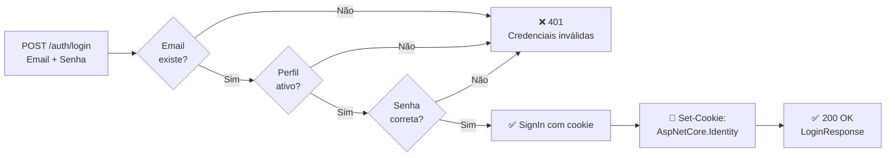
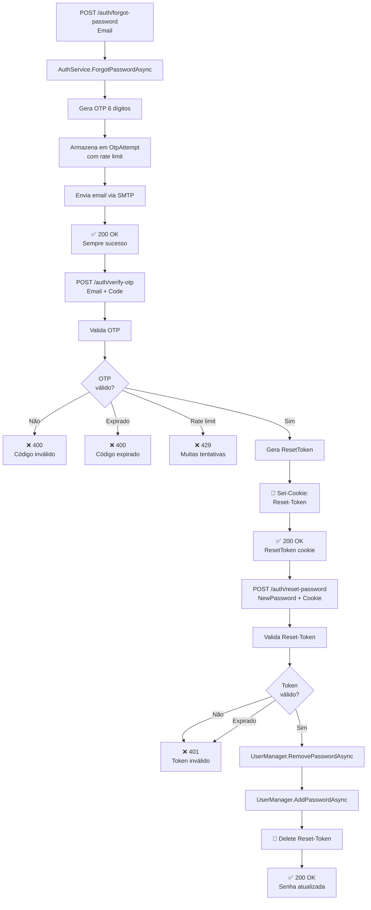
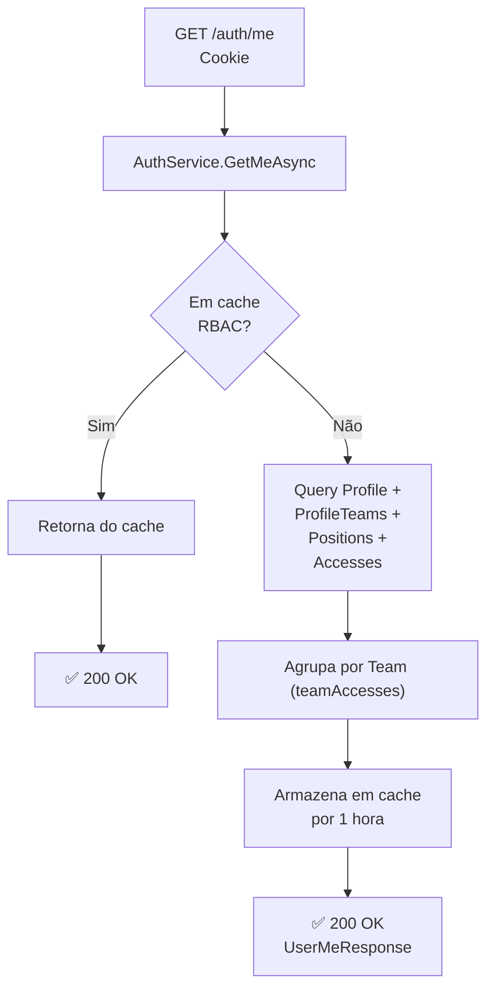

# Autenticação e Autorização

## 🔐 Fluxos de Autenticação

### 1. Login via Email/Senha



#### Fluxo Detalhado

```csharp
// 1. Usuário envia credenciais
POST /api/v1/auth/login
{
  "email": "admin@empresa.com",
  "password": "Admin123!"
}

// 2. AuthService.LoginAsync verifica:
//    - UserManager.FindByEmailAsync(email)
//    - Profile.IsActive
//    - SignInManager.PasswordSignInAsync(user, password)

// 3. Se válido, cria sessão de cookie
Response.Cookies.Append(
    "AuthToken",
  encryptedSessionToken,
  new CookieOptions
  {
    HttpOnly = true,           // Não acessível via JS
    Secure = !Request.IsHttps ? false : true,  // HTTPS em prod
    SameSite = SameSiteMode.Strict,            // CSRF protection
    Expires = DateTimeOffset.UtcNow.AddDays(1) // 1 dia
  }
);

// 4. Retorna LoginResponse com dados do usuário
{
  "code": "200",
  "message": "Login realizado com sucesso",
  "data": {
    "userId": "550e8400-...",
    "email": "admin@empresa.com",
    "name": "Administrador"
  }
}
```

**Segurança**:

- ✅ Senha em hash PBKDF2 (Identity padrão)
- ✅ Cookie HttpOnly protege contra XSS
- ✅ Cookie SameSite=Strict protege contra CSRF
- ✅ Rate limit implícito (Identity lockout)

---

### 2. Fluxo de Recuperação de Senha



#### Implementação Detalhada

```csharp
// === FORGOT PASSWORD ===
public async Task<ApiResponse<object>> ForgotPasswordAsync(string email)
{
    var user = await _userManager.FindByEmailAsync(email);

    if (user != null)
    {
        // 1. Gera OTP aleatório (6 dígitos)
        string otp = new Random().Next(100000, 999999).ToString();

        // 2. Registra tentativa de OTP (rate limiting)
        var otpAttempt = await _context.OtpAttempts
            .FirstOrDefaultAsync(o => o.UserId == user.Id &&
                                       o.Purpose == "forgot_password");

        if (otpAttempt == null)
            otpAttempt = new OtpAttempt
            {
                UserId = user.Id,
                Purpose = "forgot_password",
                AttemptCount = 0,
                WindowStartedAt = DateTime.UtcNow
            };

        // 3. Validação de brute force (5 tentativas / hora)
        if ((DateTime.UtcNow - otpAttempt.WindowStartedAt).TotalHours > 1)
        {
            otpAttempt.AttemptCount = 0;
            otpAttempt.WindowStartedAt = DateTime.UtcNow;
        }

        if (otpAttempt.AttemptCount >= 5)
        {
            otpAttempt.BlockedUntil = DateTime.UtcNow.AddHours(1);
            await _context.SaveChangesAsync();
            return new ApiResponse<object>("429", "Muitas tentativas", null);
        }

        otpAttempt.AttemptCount++;
        _context.OtpAttempts.Update(otpAttempt);

        // 4. Armazena OTP em cache por 10 minutos
        await _cache.SetAsync($"otp_{email}", otp, TimeSpan.FromMinutes(10));

        // 5. Envia email
        await _emailService.SendOtpAsync(email, otp);
    }

    // Sempre retorna 200 (não valida existência de email por segurança)
    return new ApiResponse<object>("200",
        "Se o email existe, você receberá um código de verificação", null);
}

// === VERIFY OTP ===
public async Task<ApiResponse<VerifyOtpResponse>> VerifyOtpAsync(VerifyOtpRequest request)
{
    // 1. Recupera OTP do cache
    var storedOtp = await _cache.GetAsync<string>($"otp_{request.Email}");

    if (string.IsNullOrEmpty(storedOtp))
        return new ApiResponse<VerifyOtpResponse>("400", "Código inválido ou expirado", null);

    if (storedOtp != request.Code)
        return new ApiResponse<VerifyOtpResponse>("400", "Código inválido", null);

    // 2. Gera ResetToken com 30 minutos de validade
    string resetToken = Guid.NewGuid().ToString();
    await _cache.SetAsync($"reset_token_{resetToken}", request.Email, TimeSpan.FromMinutes(10));

    // 3. Remove OTP do cache (uma única tentativa)
    await _cache.DeleteAsync($"otp_{request.Email}");

    return new ApiResponse<VerifyOtpResponse>("200", "OTP verificado com sucesso",
        new VerifyOtpResponse(resetToken, 30));
}

// === RESET PASSWORD ===
public async Task<ApiResponse<object>> ResetPasswordAsync(string resetToken, string newPassword)
{
    // 1. Valida ResetToken
    var email = await _cache.GetAsync<string>($"reset_token_{resetToken}");

    if (string.IsNullOrEmpty(email))
        return new ApiResponse<object>("401", "Token de reset inválido ou expirado", null);

    var user = await _userManager.FindByEmailAsync(email);
    if (user == null)
        return new ApiResponse<object>("401", "Usuário não encontrado", null);

    // 2. Remove senha atual
    await _userManager.RemovePasswordAsync(user);

    // 3. Define nova senha (validação automática de complexidade)
    var result = await _userManager.AddPasswordAsync(user, newPassword);

    if (!result.Succeeded)
        return new ApiResponse<object>("400", "Senha não atende aos requisitos", null);

    // 4. Invalida ResetToken
    await _cache.DeleteAsync($"reset_token_{resetToken}");

    // 5. Invalida cache RBAC do usuário
    await _cache.DeleteAsync($"rbac_v3_{user.Id}");
    await _cache.DeleteAsync($"rbac_v2_{user.Id}");
    await _cache.DeleteAsync($"rbac_{user.Id}");

    return new ApiResponse<object>("200", "Senha atualizada com sucesso", null);
}
```

**Segurança Implementada**:

- ✅ OTP válido apenas por **10 minutos**
- ✅ ResetToken válido apenas por **10 minutos**
- ✅ Rate limit de **5 tentativas por hora** por email
- ✅ OTP consumido após 1 uso (não reutilizável)
- ✅ Busca de email sem confirmar existência (evita enumeração)

---

### 3. Obten Dados de Sessão (GET /auth/me)



#### Detalhes da Implementação

```csharp
public async Task<ApiResponse<UserMeResponse>> GetMeAsync(Guid userId)
{
    // 1. Tenta obter do cache RBAC
    var cacheKey = $"rbac_v3_{userId}";
    var cachedData = await _cache.GetAsync<UserMeResponse>(cacheKey);
    if (cachedData != null)
        return new ApiResponse<UserMeResponse>("200", "", cachedData);

    // 2. Consulta BD com eager loading completo
    var profile = await _context.Profiles
        .Include(p => p.User)
        .Include(p => p.ProfileTeams)
            .ThenInclude(pt => pt.Team)
        .Include(p => p.ProfileTeams)
            .ThenInclude(pt => pt.Position)
                .ThenInclude(pos => pos.Accesses)
                    .ThenInclude(a => a.Screen)
        .Include(p => p.ProfileTeams)
            .ThenInclude(pt => pt.Position)
                .ThenInclude(pos => pos.Accesses)
                    .ThenInclude(a => a.Permission)
        .FirstOrDefaultAsync(p => p.UserId == userId);

    if (profile == null)
        return new ApiResponse<UserMeResponse>("404", "Perfil não encontrado", null);

    if (!profile.IsActive)
        return new ApiResponse<UserMeResponse>("401", "Sessão inválida ou expirada", null);

    // 3. Monta acessos por time
    var teamAccesses = profile.ProfileTeams
        .Select(pt => new TeamAccessDto(
            pt.Team.Id,
            pt.Position.Name,
            pt.Position.Department?.Name ?? "N/A",
            BuildAccesses(pt.Position.Accesses)
        ))
        .ToList();

    var response = new UserMeResponse(
        new ProfileResponse(
            profile.Id,
            profile.Name,
            profile.AvatarUrl,
            profile.User.Email!,
            profile.IsActive
        ),
        profile.ProfileTeams
            .Select(pt => new UserTeamDto(
                pt.Team.Id,
                pt.Team.Name,
                pt.Team.LogotipoUrl
            ))
            .ToList(),
        teamAccesses
    );

    // 4. Armazena em cache por 1 hora
    await _cache.SetAsync(cacheKey, response, TimeSpan.FromHours(1));

    return new ApiResponse<UserMeResponse>("200", "", response);
}
```

**Estrutura de Resposta**:

```json
{
  "code": "200",
  "message": "",
  "data": {
    "profile": {
      "id": "550e8400-e29b-41d4-a716-446655440000",
      "name": "Administrador",
      "avatarUrl": null,
      "email": "admin@empresa.com",
      "isActive": true
    },
    "teams": [
      {
        "id": "660e8400-e29b-41d4-a716-446655440000",
        "name": "Operações",
        "logotipoUrl": null
      }
    ],
    "teamAccesses": [
      {
        "teamId": "660e8400-e29b-41d4-a716-446655440000",
        "position": "Gerente",
        "department": "TI",
        "accesses": [
          {
            "nameKey": "users_management",
            "nameSidebar": "Usuários",
            "permissions": ["view", "create", "delete"]
          }
        ]
      }
    ]
  }
}
```

**Otimizações**:

- ✅ Cache RBAC por **1 hora** reduz queries ao BD
- ✅ Eager loading evita N+1 queries
- ✅ Invalidação manual em mudanças (ver [AUTHORIZATION-RBAC.md](AUTHORIZATION-RBAC.md))

---

## 🔓 Logout

```csharp
[HttpPost("logout")]
[Authorize]
public async Task<IActionResult> Logout()
{
    // 1. Limpa cookie de sessão
    await _signInManager.SignOutAsync();

    // 2. Invalida cache RBAC
    var userId = User.FindFirstValue(ClaimTypes.NameIdentifier);
    if (userId != null)
        await _cache.DeleteAsync($"rbac_v3_{userId}");
        await _cache.DeleteAsync($"rbac_v2_{userId}");
        await _cache.DeleteAsync($"rbac_{userId}");

    return Ok(new { Message = "Logout realizado com sucesso" });
}
```

---

## 🍪 Gerenciamento de Cookies

### Auth Cookie

```csharp
options.Cookie.HttpOnly = true;                 // Protege XSS
options.Cookie.SecurePolicy =
    builder.Environment.IsDevelopment()
        ? CookieSecurePolicy.SameAsRequest
        : CookieSecurePolicy.Always;            // HTTPS em prod
options.Cookie.SameSite = SameSiteMode.Strict;  // Protege CSRF
options.ExpireTimeSpan = TimeSpan.FromDays(1);  // 1 dia
options.SlidingExpiration = true;               // Renova automaticamente
```

### Reset Token Cookie

```csharp
Response.Cookies.Append("Reset-Token", resetToken, new CookieOptions
{
    HttpOnly = true,
    Secure = !Request.IsHttps ? false : true,
    SameSite = SameSiteMode.Strict,
    Path = "/api",                              // Apenas /api
    Expires = DateTimeOffset.UtcNow.AddMinutes(10)
});
```

---

## 🔐 Validação de Senha

### Requisitos Implementados

```csharp
builder.Services.AddIdentity<User, IdentityRole<Guid>>(options => {
    options.Password.RequireDigit = true;           // Requisição mínimo 1 dígito
    options.Password.RequiredLength = 8;            // Mínimo 8 caracteres
    options.Password.RequireNonAlphanumeric = true; // Requisição !@#$%...
    options.Password.RequireUppercase = false;      // Maiúsculas (opcional)
    options.Password.RequireLowercase = false;      // Minúsculas (opcional)
    options.User.RequireUniqueEmail = true;         // Email único
})
.AddEntityFrameworkStores<AppDbContext>()
.AddDefaultTokenProviders();
```

**Exemplo de Senhas**:

- ❌ `pass` - muito curta
- ❌ `password123` - sem caractere especial
- ❌ `Pass@123` - ✅ OK (maiúscula, dígito, especial, 8+ chars)

---

## 📋 Resumo de Fluxos

| Fluxo  | Endpoints             | Rate Limit                   | Cache            | Validação      |
| ------ | --------------------- | ---------------------------- | ---------------- | -------------- |
| Login  | POST /login           | Implícito (Identity lockout) | ❌               | Senha PBKDF2   |
| Forgot | POST /forgot-password | 5 tentativas/hora            | OTP 10min        | Email          |
| Verify | POST /verify-otp      | 5 tentativas/hora            | ResetToken 30min | OTP            |
| Reset  | POST /reset-password  | ❌                           | ResetToken 30min | Senha complexa |
| Me     | GET /me               | ❌                           | RBAC 1h          | Sessão ativa   |
| Logout | POST /logout          | ❌                           | Invalida cache   | Token válido   |

---

## 🔗 Documentação Relacionada

- [AUTHORIZATION-RBAC.md](AUTHORIZATION-RBAC.md) - Sistema de permissões
- [ENDPOINTS.md](ENDPOINTS.md) - Referência de APIs
- [ERROR-HANDLING.md](ERROR-HANDLING.md) - Códigos de erro

---

**Próximos passos?** 👉 Leia [AUTHORIZATION-RBAC.md](AUTHORIZATION-RBAC.md) para RBAC.

---

## 🆕 Atualizacao Abril 2026

### Cache de RBAC

- A chave principal do contexto de permissao passou para `rbac_v4_{userId}`.
- Durante login, logout e reset de senha, tambem sao invalidadas chaves legadas (`rbac`, `rbac_v2`, `rbac_v3`) para compatibilidade.

### Contrato de resposta do /auth/me

- `AccessDto` agora inclui `name` alem de `nameKey` e `nameSidebar`.
- `UserTeamDto` agora inclui `isActive` para controle de times ativos no frontend.

Exemplo simplificado:

```json
{
  "teamAccesses": [
    {
      "accesses": [
        {
          "nameKey": "teams_management",
          "name": "Gerenciamento de Times",
          "nameSidebar": "Equipes",
          "permissions": ["view", "create", "update", "delete"]
        }
      ]
    }
  ],
  "teams": [
    {
      "id": "...",
      "name": "Operações",
      "logotipoUrl": "/uploads/logo.png",
      "isActive": true
    }
  ]
}
```
