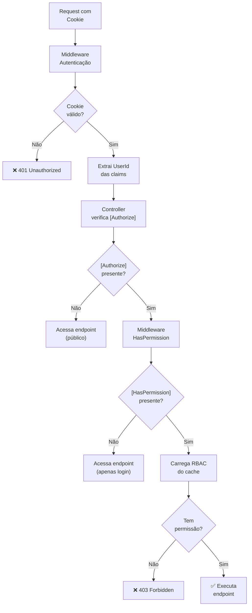

# Autorização e RBAC (Role-Based Access Control)

## 🔑 Conceitos Principais

A DAINAI API implementa **RBAC baseado em Posições** ao invés do modelo tradicional de "Roles". Isso permite maior granularidade:

```
User (Usuário)
    ↓
Profile (Dados pessoais)
    ↓
ProfileTeam (Vinculação com time + posição)
    ↓
Position (Cargo/Função)
    ↓
Access (Posição + Tela + Permissão)
    ↓
Screen (Módulo da aplicação)
Permission (Ação: view, create, update, delete)
```

---

## 📊 Modelo de Dados

### Tabelas Principais

```
┌──────────────────┐
│ AspNetUsers      │  ← ASP.NET Identity
│ (built-in)       │
└────────┬─────────┘
         │
┌────────┴──────────┐
│ Profiles          │  1:1 com User
│ - id (uuid)       │
│ - user_id         │
│ - name            │
│ - is_active       │
└────────┬──────────┘
         │
┌────────┴──────────┐
│ ProfileTeam       │  N:N com Teams
│ - id              │      e Positions
│ - profile_id      │
│ - team_id         │
│ - position_id     │
└─────────────────────┘

┌──────────────────┐
│ Positions        │
│ - id (int)       │
│ - name           │
│ - department_id  │
│ - is_active      │
└────────┬─────────┘
         │
┌────────┴──────────┐
│ Access           │  N:N com Screens
│ - id             │      e Permissions
│ - position_id    │
│ - screen_id      │
│ - permission_id  │
└─────────────────────┘

┌──────────────────┐
│ Screens          │
│ - id (int)       │
│ - name           │
│ - name_key       │  ← Identificador único
└──────────────────┘

┌──────────────────┐
│ Permissions      │
│ - id (int)       │
│ - name           │
│ - name_key       │
└──────────────────┘
```

---

## 🎯 Fluxo de Autorização



---

## 🔓 Atributos de Autorização

### [AllowAnonymous]

Permite acesso sem autenticação.

```csharp
[HttpPost("login")]
[AllowAnonymous]
public async Task<IActionResult> Login([FromBody] LoginRequest request)
{
    // Qualquer pessoa pode chamar este endpoint
}
```

### [Authorize]

Requer autenticação (cookie válido).

```csharp
[HttpGet("me")]
[Authorize]
public async Task<IActionResult> Me()
{
    // Apenas usuários autenticados podem chamar
    var userId = User.FindFirstValue(ClaimTypes.NameIdentifier);
}
```

### [HasPermission]

Requer autenticação + permissão específica.

```csharp
[HttpGet("profiles")]
[HasPermission("users_management", "view")]
public async Task<IActionResult> GetProfiles()
{
    // Apenas usuários com permissão users_management:view
}
```

#### Implementação do HasPermission

```csharp
[AttributeUsage(AttributeTargets.Method)]
public class HasPermissionAttribute : Attribute, IAsyncAuthorizationFilter
{
    private readonly string _resource;
    private readonly string _action;

    public HasPermissionAttribute(string resource, string action)
    {
        _resource = resource;
        _action = action;
    }

    public async Task OnAuthorizationAsync(AuthorizationFilterContext context)
    {
        var user = context.HttpContext.User;

        // 1. Verifica se está autenticado
        if (!user.Identity?.IsAuthenticated ?? false)
        {
            context.Result = new UnauthorizedResult();
            return;
        }

        // 2. Extrai UserId
        var userId = user.FindFirstValue(ClaimTypes.NameIdentifier);
        if (string.IsNullOrEmpty(userId))
        {
            context.Result = new UnauthorizedResult();
            return;
        }

        // 3. Obtém serviço de RBAC
        var rbacService = context.HttpContext.RequestServices
            .GetRequiredService<IAuthService>();

        // 4. Carrega permissões do cache
        var response = await rbacService.GetMeAsync(Guid.Parse(userId));

        if (response.Code != "200" || response.Data?.Accesses == null)
        {
            context.Result = new ForbidResult();
            return;
        }

        // 5. Verifica se tem a permissão solicitada
        var hasPermission = response.Data.Accesses
            .FirstOrDefault(a => a.Screen == _resource)?
            .Permissions.Contains(_action) ?? false;

        if (!hasPermission)
        {
            context.Result = new ForbidResult();
            return;
        }
    }
}
```

---

## 🏢 Estrutura de Domínios

### Posições (Cargos)

Cada posição pode ter múltiplas permissões em múltiplas telas:

```
Position: Administrador
├─ Screen: users_management
│  ├─ Permission: view
│  ├─ Permission: create
│  └─ Permission: delete
├─ Screen: teams_management
│  ├─ Permission: view
│  └─ Permission: create
└─ Screen: screens_management
   ├─ Permission: view
   └─ Permission: update
```

### Exemplo de Acesso Estruturado

```json
{
  "users_management": ["view", "create", "delete"],
  "teams_management": ["view", "create"],
  "screens_management": ["view", "update"]
}
```

---

## 📋 Permissões Padrão do Sistema

### Seeded no DbInitializer

```csharp
var permissions = new List<Permission>
{
    new Permission { Id = 1, Name = "Visualizar", NameKey = "view" },
    new Permission { Id = 2, Name = "Criar", NameKey = "create" },
    new Permission { Id = 3, Name = "Atualizar", NameKey = "update" },
    new Permission { Id = 4, Name = "Deletar", NameKey = "delete" }
};
```

### Telas do Sistema

```csharp
var screens = new List<Screen>
{
    new Screen { Id = 1, Name = "Gerenciamento de Usuários",
                NameSidebar = "Usuários", NameKey = "users_management" },
    new Screen { Id = 2, Name = "Gerenciamento de Times",
                NameSidebar = "Times", NameKey = "teams_management" },
    new Screen { Id = 3, Name = "Controle de Acesso",
                NameSidebar = "Acessos", NameKey = "access_control" },
    new Screen { Id = 4, Name = "Gerenciamento de Telas",
                NameSidebar = "Telas", NameKey = "screens_management" }
};
```

### Posições do Sistema

```csharp
var adminPosition = new Position
{
    Id = 1,
    Name = "Administrador",
    DepartmentId = 1,
    IsActive = true
};

// Administrador tem acesso total
var adminAccesses = new List<Access>
{
    new Access { PositionId = 1, ScreenId = 1, PermissionId = 1 }, // users_management:view
    new Access { PositionId = 1, ScreenId = 1, PermissionId = 2 }, // users_management:create
    new Access { PositionId = 1, ScreenId = 1, PermissionId = 4 }, // users_management:delete
    // ... todas as combos possíveis
};
```

---

## 💾 Cache de RBAC

### Invalidação Automática

O cache RBAC é armazenado em Redis com TTL de **1 hora**. Quando há mudanças, o cache é invalidado:

```csharp
// Quando um usuário é criado/deletado/ativado
await _cache.DeleteAsync($"rbac_{userId}");

// Quando permissões de posição mudam
await _cache.DeleteAsync($"rbac_position_{positionId}");

// Invalidação em massa ao logar
var cacheKey = $"rbac_{userId}";
await _cache.DeleteAsync(cacheKey);
```

### Estrutura no Cache

```
Key: "rbac_550e8400-e29b-41d4-a716-446655440000"
TTL: 1 hora

Value (UserMeResponse):
{
  "profile": {
    "id": "550e8400-...",
    "name": "Administrador",
    "email": "admin@empresa.com",
    "isActive": true
  },
  "teams": [
    {
      "id": "660e8400-...",
      "name": "Operações",
      "logotipoUrl": null
    }
  ],
  "teamAccesses": [
    {
      "teamId": "660e8400-...",
      "position": "Gerente",
      "department": "TI",
      "accesses": [
        {
          "nameKey": "users_management",
          "nameSidebar": "Usuários",
          "permissions": ["view", "create", "delete"]
        }
      ]
    }
  ]
}
```

---

## 🔒 Casos de Uso

### Caso 1: Visualizar Usuários

```csharp
[HttpGet("profiles")]
[HasPermission("users_management", "view")]
public async Task<IActionResult> GetProfiles()
{
    // Usuário logado com permissão users_management:view
    // pode executar esta ação
}
```

**Verificação**:

1. Cookie válido?
2. Tem `users_management:view`?
3. Se sim → 200 OK com lista de perfis
4. Se não → 403 Forbidden

---

### Caso 2: Criar Novo Usuário

```csharp
[HttpPost("profiles")]
[HasPermission("users_management", "create")]
public async Task<IActionResult> CreateProfile([FromBody] CreateProfileRequest request)
{
    // Requer permissão users_management:create
}
```

**Fluxo**:

1. Valida autenticação
2. Carrega RBAC do cache
3. Verifica se tem `users_management:create`
4. Se sim → cria perfil
5. Se não → 403 Forbidden

---

### Caso 3: Múltiplas Posições

Um usuário pode ter múltiplas posições em diferentes times:

```json
{
  "profile": {
    "id": "550e8400-...",
    "name": "João Silva"
  },
  "teams": [
    {
      "id": "team1",
      "name": "TI",
      "logotipoUrl": null
    },
    {
      "id": "team2",
      "name": "Operações",
      "logotipoUrl": null
    }
  ],
  "teamAccesses": [
    {
      "teamId": "team1",
      "position": "Administrador",
      "department": "TI",
      "accesses": [
        {
          "nameKey": "users_management",
          "nameSidebar": "Usuários",
          "permissions": ["view", "create"]
        }
      ]
    },
    {
      "teamId": "team2",
      "position": "Supervisor",
      "department": "Operações",
      "accesses": [
        { "nameKey": "teams_management", "nameSidebar": "Equipes", "permissions": ["view"] }
      ]
    }
  ]
}
```

---

## 🛡️ Segurança

### Propriedades Protegidas

- ✅ Permissões são alteradas **apenas por migration/seed**
- ✅ Telas (screens) não podem ser criadas/deletadas por API
- ✅ Atributo `[HasPermission]` é **obrigatório** para endpoints sensíveis
- ✅ Cache RBAC é **invalidado em mudanças de status** do usuário

### Padrão de Segurança

```csharp
// ❌ Ruim - sem validação
[HttpGet("admin-data")]
[Authorize]
public IActionResult GetAdminData()
{
    // Qualquer usuário autenticado pode acessar!
}

// ✅ Bom - com validação
[HttpGet("admin-data")]
[HasPermission("admin", "view")]
public IActionResult GetAdminData()
{
    // Apenas usuários com permissão admin:view
}
```

---

## 📈 Fluxo de Agregação de Permissões

```csharp
// GetMeAsync agrupa permissões de todas as posições

var accesses = profile.ProfileTeams          // Todas posições
    .SelectMany(pt => pt.Position.Accesses)  // Todas as permissões
    .GroupBy(a => a.Screen.NameKey)          // Agrupa por tela
    .Select(g => new AccessDto(
        g.Key,
        g.Select(a => a.Permission.NameKey)
         .Distinct()                          // Remove duplicatas
         .ToList()
    ))
    .ToList();
```

**Exemplo**:

- Position 1 (Admin): users_management [view, create, delete]
- Position 2 (Supervisor): users_management [view], teams_management [view]
- **Resultado aggregado**:
  - users_management [view, create, delete]
  - teams_management [view]

---

## 📋 Tabela de Permissões

| Resource             | view | create | update | delete |
| -------------------- | ---- | ------ | ------ | ------ |
| `users_management`   | ✅   | ✅     | ❌     | ✅     |
| `teams_management`   | ✅   | ✅     | ❌     | ❌     |
| `access_control`     | ✅   | ✅     | ❌     | ✅     |
| `screens_management` | ✅   | ❌     | ✅     | ❌     |

---

## 🔗 Documentação Relacionada

- [AUTHENTICATION.md](AUTHENTICATION.md) - Fluxos de login/logout
- [ENDPOINTS.md](ENDPOINTS.md) - Referência de APIs e seus perms
- [DATABASE.md](DATABASE.md) - Schema de tabelas relacionadas

---

**Próximos passos?** 👉 Leia [MODELS.md](MODELS.md) para entidades de BD.
