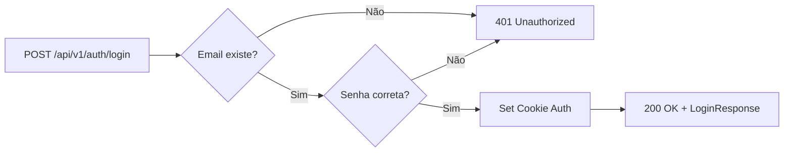
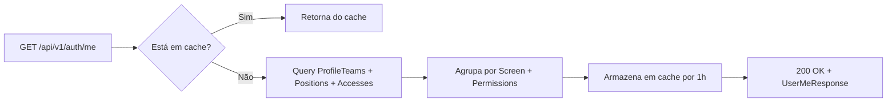

# DAINAI API - Documentação Completa

## 📋 Visão Geral

A **DAINAI API** é um serviço backend moderno construído com **ASP.NET Core 10.0**, responsável por gerenciar autenticação, autorização baseada em papéis (RBAC), perfis de usuários, equipes, telas e controle de acesso.

A API segue uma arquitetura em **4 camadas**:

- **Web Layer**: Controllers e Attributes de validação
- **Application Layer**: DTOs e Interfaces de serviço
- **Infrastructure Layer**: Implementação de serviços, banco de dados e cache
- **Domain Layer**: Entidades de negócio

---

## 🚀 Quick Start

### Pré-requisitos

- Docker & Docker Compose instalados
- .NET 10.0 SDK (para desenvolvimento local)
- PostgreSQL 16 (via Docker)
- Redis 7 (via Docker)

### Iniciar a API

```bash
# Na raiz do projeto
docker compose up -d api db redis mailhog

# Verificar se está rodando
docker compose ps

# Acessar Swagger
open http://localhost:5000/swagger
```

### Variáveis de Ambiente

Veja [DEPLOYMENT.md](DEPLOYMENT.md) para configuração completa de `.env`

```env
ASPNETCORE_ENVIRONMENT=Development
ConnectionStrings__DefaultConnection=Host=db;Port=5432;Database=dainaidb;Username=user;Password=password
SeedDatabase=true
Redis__ConnectionString=redis:6379
```

---

## 📚 Estrutura da Documentação

| Documento                                      | Descrição                                                                       |
| ---------------------------------------------- | ------------------------------------------------------------------------------- |
| [ARCHITECTURE.md](ARCHITECTURE.md)             | Arquitetura em camadas, padrões e fluxo de requisição                           |
| [ENDPOINTS.md](ENDPOINTS.md)                   | Referência completa de todos os endpoints (Auth e Admin)                        |
| [AUTHENTICATION.md](AUTHENTICATION.md)         | Fluxos de login, recuperação de senha, OTP                                      |
| [AUTHORIZATION-RBAC.md](AUTHORIZATION-RBAC.md) | Sistema de roles, permissões, controle de acesso                                |
| [MODELS.md](MODELS.md)                         | Entidades de banco de dados e DTOs                                              |
| [SERVICES.md](SERVICES.md)                     | Detalhes de implementação dos serviços de negócio                               |
| [DATABASE.md](DATABASE.md)                     | Schema, relacionamentos, migrações (veja database-schema.md e database-seed.md) |
| [TESTING.md](TESTING.md)                       | Estratégia de testes unitários e E2E                                            |
| [DEPLOYMENT.md](DEPLOYMENT.md)                 | Docker, Docker Compose, variáveis de ambiente                                   |
| [ERROR-HANDLING.md](ERROR-HANDLING.md)         | Padrão de respostas de erro e códigos HTTP                                      |

---

## 🛠️ Stack Técnico

### Backend

- **Framework**: ASP.NET Core 10.0 (C#)
- **Autenticação**: ASP.NET Core Identity + Cookie-based
- **ORM**: Entity Framework Core 10.0 + Npgsql
- **Cache**: Redis via StackExchange.Redis
- **Email**: System.Net.Mail (SMTP)
- **API Docs**: Swashbuckle + OpenAPI 3.0

### Banco de Dados

- **PostgreSQL 16-alpine**: Banco relacional principal
- **In-Memory DB**: Para testes isolados
- **Migrações**: EF Core Migrations com seed automático

### Infra

- **Docker & Compose**: Orquestração de serviços
- **Redis**: Cache distribuído (opcional)
- **Mailhog**: SMTP em ambiente de desenvolvimento

---

## 🔐 Segurança

### Autenticação

- Senhas hasheadas com **PBKDF2** (Identity padrão)
- Requisitos mínimos: 8 caracteres + dígito + caractere não-alfanumérico
- Cookies com flag **HttpOnly**, **Secure** e **SameSite=Strict**
- Suporte a **OTP** (One-Time Password) para fluxos sensíveis

### Autorização

- **RBAC** (Role-Based Access Control) via **Positions** e **Accesses**
- Permissões granulares por tela (Screen) e ação (view, create, update, delete)
- Atributo customizado `[HasPermission]` para validação em controllers
- Cache de RBAC com TTL de 1 hora (invalidação manual em mudanças)

### Dados Sensíveis

- `.env` com credenciais **não é versionado** (.gitignore)
- Senhas de email não aparecem em logs
- Reset token armazenado apenas em cookie HttpOnly por 30 minutos

---

## 📊 Modelos Principais

### Usuários e Autenticação

```
AspNetUsers (ASP.NET Identity)
    ↓
Profile (nome, avatar, is_active)
    ↓
ProfileTeam (vinculação com time + posição)
    ↓
Position (cargo, departamento)
    ↓
Access (tela + permissão por cargo)
```

### Controle de Acesso

```
Screen (tela/módulo da aplicação)
    ↓
Permission (ação: view, create, update, delete)
    ↓
Access (posição + tela + permissão)
```

---

## 🔄 Fluxos Principais

### 1️⃣ Login



### 2️⃣ Recuperação de Senha

```mermaid
graph LR
    A[POST /api/v1/auth/forgot-password] --> B[Gera OTP 6 dígitos]
    B --> C[Envia email com OTP]
    C --> D[200 OK]
    D --> E[POST /api/v1/auth/verify-otp]
    E --> F[Valida OTP + rate limit]
    F --> G[Set Reset-Token Cookie]
    G --> H[200 OK]
    H --> I[POST /api/v1/auth/reset-password]
    I --> J[Valida Reset-Token]
    J --> K[Altera senha]
    K --> L[Delete Reset-Token Cookie]
    L --> M[200 OK]
```



### 3️⃣ Carregamento de Permissões do Usuário



---

## 📞 Suporte e Contribuição

- **Issues**: Abra no repositório do projeto
- **Docs**: Mantenha atualizado ao adicionar novos endpoints
- **Tests**: Adicione testes para todo novo feature
- **Code Review**: Solicite review antes de merge

---

## 📝 Última Atualização

- **Data**: Abril 2026
- **Versão API**: v1
- **Status**: Pronto para produção (com validações)
- **Endpoints totais**: 16 (Auth + Admin)

---

**Próximos passos?** 👉 Leia [ARCHITECTURE.md](ARCHITECTURE.md) para entender a estrutura em camadas.
