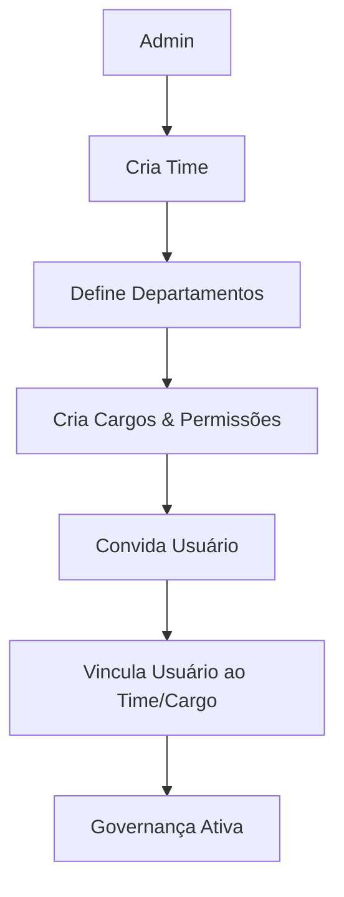

# Conceito de Módulo: Admin (Gestão Organizacional)
**Categorias:** Gestão, Governança, Estrutura

---

## 1. Definição e Propósito
O módulo **Admin** resolve a complexidade de gerenciar grandes estruturas organizacionais. Seu objetivo é permitir que administradores definam "Quem pode fazer o que e onde", gerenciando usuários, times, cargos e as permissões granulares que regem todo o ecossistema do sistema.

## 2. Fluxo Conceitual (A Experiência do Usuário)
1. **Entrada de Dados:** O administrador define a estrutura base (Departamentos e Cargos) e os agrupamentos operacionais (Times). Em seguida, insere informações de novos membros.
2. **Processamento:** O sistema orquestra as relações entre estas entidades. Ele valida se um cargo tem as permissões corretas para cada tela do sistema e garante que um usuário possa ter múltiplos papéis em diferentes times sem conflitos. Ao criar um usuário, o sistema automatiza o envio de boas-vindas e configuração de acesso.
3. **Saída/Resultado:** Uma estrutura de governança clara onde as responsabilidades são bem definidas e o acesso aos dados é restrito por necessidade e cargo, garantindo conformidade e organização.

## 3. Funções Principais e Automações
* **Gestão de Usuários:** Controle total sobre o ciclo de vida do colaborador (criação, edição, suspensão).
* **Estruturação de Times:** Agrupamento lógico de usuários para isolamento de dados e projetos.
* **Matriz de Permissões (RBAC):** Definição de acessos por tela (Visualizar, Criar, Editar, Excluir) e por escopo (Apenas os próprios dados, dados do Time, ou dados de todo o Sistema).
* **Gestão de Cargos e Departamentos:** Padronização das funções dentro da organização.
* **Automação de Convites:** Processo automático de convite via e-mail para novos usuários com link de ativação seguro.

## 4. Regras de Negócio (O "Coração" do Módulo)
* **RN04:** Não é permitido excluir um departamento ou time que possua usuários ou cargos vinculados (integridade referencial).
* **RN05:** As chaves de sistema (NameKeys) de telas e permissões são imutáveis após a criação para evitar quebra de lógica no código.
* **RN06:** Um usuário pode estar vinculado a múltiplos times, mas deve ter um cargo específico para cada um deles.

## 5. Requisitos do Conceito

### 5.1 Requisitos Funcionais (O que deve existir)
* **RF05:** Capacidade de gerenciar usuários e seus perfis básicos.
* **RF06:** Possibilidade de criar e gerenciar times de trabalho.
* **RF07:** Capacidade de definir departamentos e cargos com hierarquia simples.
* **RF08:** Possibilidade de configurar permissões granulares por cargo para cada módulo do sistema.
* **RF09:** Capacidade de visualizar indicadores de uso (Total de usuários, ativos, cargos cadastrados).

### 5.2 Requisitos Não Funcionais (Como deve se comportar)
* **RNF03:** Granularidade total nas permissões, permitindo que o sistema se adapte a diferentes políticas de segurança corporativa.
* **RNF04:** Rastreabilidade: Toda alteração crítica em usuários ou permissões deve ser passível de auditoria futura.

## 6. Fronteiras e Integrações
* **Comunicação Interna:** Recebe o contexto de sessão do Módulo **Auth** e fornece a "árvore de permissões" para todos os outros módulos (Project, Document).
* **Serviços Externos:** Utiliza serviços de e-mail para envio de convites e notificações administrativas.

---
**Notas de Validação:**
* Confirmar se a exclusão de um usuário deve ser física (remover do banco) ou lógica (soft-delete para manter histórico).
* Validar se um cargo pode herdar permissões de outro ou se cada um é isolado.

---
**Fases de Evolução:**
* **Fase 1 (Independente):** Cadastro de usuários e times básicos.
* **Fase 2 (Dependente de Auth):** Integração total com o fluxo de login para aplicação imediata das permissões definidas.
