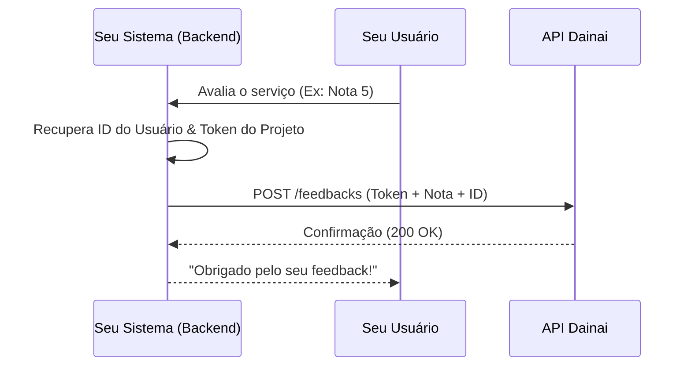

# Manual de Integração: API de Feedback Pública
**Versão:** 1.0
**Contexto:** Integração Externa (SaaS, Apps, Portais)

---

## 1. Introdução
A API de Feedback do Dainai permite que sistemas externos (como o seu portal de cliente ou aplicativo móvel) enviem avaliações de satisfação dos usuários diretamente para um projeto específico dentro da plataforma. Essas notas são consolidadas em dashboards para análise de qualidade e engajamento.

## 2. Autenticação e Segurança
A autenticação é feita via **Token de Projeto**. Cada projeto no Dainai possui uma chave única que deve ser enviada no cabeçalho (header) de todas as requisições.

*   **Header**: `x-project-token`
*   **Onde encontrar o Token**: No painel do Dainai, acesse a página de detalhes do seu Projeto e procure pela seção "Integração".

> [!IMPORTANT]
> Nunca exponha seu Token de Projeto em códigos Client-Side (Frontend) públicos. Recomenda-se realizar a chamada à API a partir do seu servidor (Backend).

## 3. Endpoints

### 3.1 Enviar ou Atualizar Feedback
Envia uma nota de satisfação de um usuário. O sistema utiliza uma lógica de **Upsert**: se o `refUserId` já enviou uma nota para este projeto, a nota anterior será atualizada; caso contrário, um novo registro será criado.

*   **URL**: `POST /api/v1/public/feedbacks`
*   **Content-Type**: `application/json`

#### Estrutura do Payload (JSON):
| Campo | Tipo | Obrigatório | Descrição |
| :--- | :--- | :--- | :--- |
| `refUserId` | `string` | Sim | Identificador único do seu usuário no sistema externo (ex: e-mail ou UUID). |
| `note` | `integer` | Sim | Nota da avaliação. Deve ser um valor inteiro entre **1 e 5**. |

#### Exemplo de Requisição (cURL):
```bash
curl -X POST "https://api.dainai.com/api/v1/public/feedbacks" \
     -H "x-project-token: SEU_TOKEN_AQUI" \
     -H "Content-Type: application/json" \
     -d '{
           "refUserId": "user_12345",
           "note": 5
         }'
```

#### Exemplo de Resposta (Sucesso):
```json
{
  "code": "200",
  "message": "Feedback successfully registered.",
  "data": null
}
```

## 4. Tratamento de Erros
A API utiliza códigos HTTP padrão para indicar o status da operação:

| Código | Descrição | Causa Provável |
| :--- | :--- | :--- |
| `200` | Sucesso | O feedback foi registrado ou atualizado com sucesso. |
| `400` | Requisição Inválida | Nota fora do intervalo (1-5) ou campos obrigatórios ausentes. |
| `401` | Não Autorizado | Token de projeto ausente, inválido ou projeto desativado. |
| `500` | Erro Interno | Problema momentâneo no servidor do Dainai. |

## 5. Fluxo de Implementação Recomendado



## 6. Boas Práticas
1.  **Cache de Token**: Não armazene o token de forma estática no código; utilize variáveis de ambiente.
2.  **Idempotência**: Você pode reenviar a mesma nota várias vezes sem criar duplicatas, pois o sistema se baseia no `refUserId`.
3.  **Monitoramento**: Caso receba muitos erros `401`, verifique se o token foi rotacionado no painel do Dainai.
