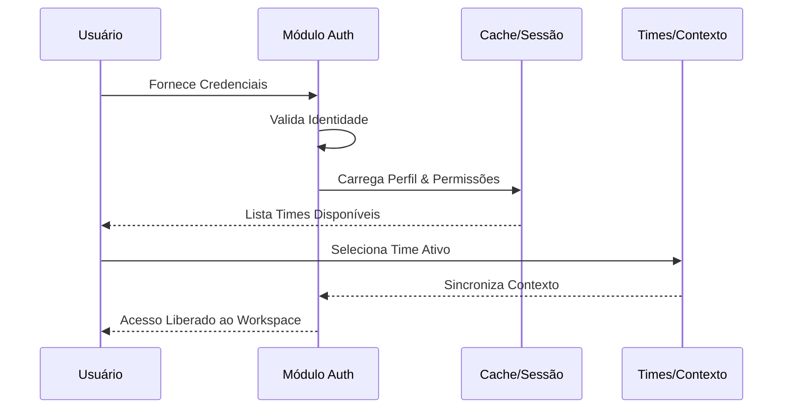

# Conceito de Módulo: Auth (Autenticação e Identidade)
**Categorias:** Acesso, Segurança, Identidade

---

## 1. Definição e Propósito
O módulo **Auth** resolve a necessidade crítica de garantir que apenas usuários autorizados acessem o sistema, protegendo a integridade dos dados. Seu objetivo principal é gerenciar o ciclo de vida da identidade do usuário, desde a entrada (login) até a manutenção da segurança da conta (recuperação de senha e MFA), estabelecendo a base para o controle de acesso baseado em cargos (RBAC).

## 2. Fluxo Conceitual (A Experiência do Usuário)
1. **Entrada de Dados:** O usuário inicia sua jornada fornecendo suas credenciais de identidade. Em casos de esquecimento, o sistema solicita o e-mail para validação externa.
2. **Processamento:** O sistema valida a identidade através de mecanismos criptográficos, verifica o status da conta (ativa/inativa) e, se necessário, exige uma segunda camada de validação via código temporário (OTP). Após a validação, o sistema carrega o contexto de "Quem é este usuário" e "A quais times ele pertence".
3. **Saída/Resultado:** Um ambiente seguro e personalizado, onde o usuário possui uma sessão ativa e pode transitar entre diferentes times (contextos) com suas permissões devidamente mapeadas.

## 3. Funções Principais e Automações
* **Gestão de Identidade:** Validação de credenciais e manutenção de perfis de usuário.
* **Recuperação de Acesso:** Fluxo automatizado de reset de senha com validação por e-mail.
* **Segurança Multifator (MFA):** Camada adicional de proteção usando códigos de uso único (OTP).
* **Seleção de Contexto:** Capacidade de alternar entre diferentes times de trabalho mantendo a mesma identidade.
* **Automação de Revogação:** Deslogue automático e invalidação de cache de permissões quando uma conta é desativada ou a senha é alterada.

## 4. Regras de Negócio (O "Coração" do Módulo)
* **RN01:** O acesso é estritamente vinculado ao status do perfil; perfis inativos não podem gerar novas sessões ou manter sessões existentes.
* **RN02:** Se um usuário pertencer a apenas um time e este time for desativado, o acesso ao sistema deve ser bloqueado globalmente para este usuário.
* **RN03:** Códigos de verificação (OTP) possuem validade temporal curta (10 minutos) e limite de tentativas para prevenir ataques de força bruta.

## 5. Requisitos do Conceito

### 5.1 Requisitos Funcionais (O que deve existir)
* **RF01:** Capacidade de autenticar usuários via e-mail e senha.
* **RF02:** Possibilidade de solicitar recuperação de senha através de código enviado por e-mail.
* **RF03:** Capacidade de gerenciar a sessão do usuário via tokens seguros.
* **RF04:** Possibilidade de selecionar e alternar o time ativo para contextualização do sistema.

### 5.2 Requisitos Não Funcionais (Como deve se comportar)
* **RNF01:** Criptografia de ponta a ponta no tráfego de credenciais e armazenamento de senhas com hashing forte.
* **RNF02:** O tempo de resposta para validação de identidade não deve exceder 500ms em condições normais.

## 6. Fronteiras e Integrações
* **Comunicação Interna:** Envia o ID do usuário e do time ativo para o Módulo **Admin** para validação de permissões e para o Módulo **Project/Document** para filtragem de dados.
* **Serviços Externos:** Integra-se com serviços de envio de e-mail (SMTP/API) para entrega de códigos OTP e links de convite.

---
**Notas de Validação:**
* O cliente deve confirmar se o fluxo de troca de time exige um novo login ou se é transparente (apenas recarga de contexto).
* Validar se a expiração da sessão deve ser deslizante (renovada a cada uso) ou fixa.

---
**Fases de Evolução:**
* **Fase 1 (Independente):** Login básico, logout e gestão de perfil simples.
* **Fase 2 (Dependente de Admin):** Implementação de RBAC, troca de times e permissões dinâmicas baseadas na estrutura organizacional definida no Admin.
