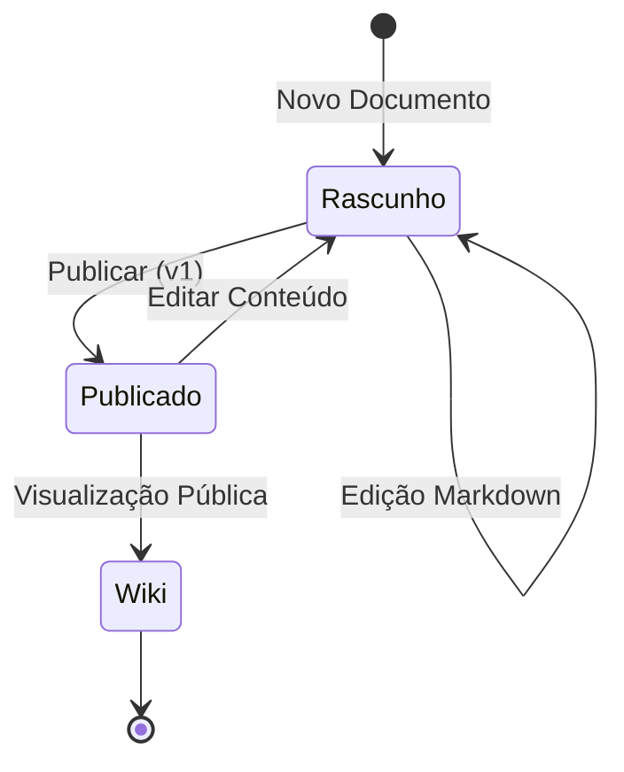

# Conceito de Módulo: Document (Gestão de Conhecimento)
**Categorias:** Conteúdo, Wiki, Conhecimento

---

## 1. Definição e Propósito
O módulo **Document** resolve o problema da dispersão e obsolescência da informação técnica e corporativa. Seu objetivo é fornecer uma ferramenta centralizada para criação, versionamento e consumo de conhecimento em formato Markdown, garantindo que a "verdade oficial" seja facilmente encontrável e mantida.

## 2. Fluxo Conceitual (A Experiência do Usuário)
1. **Entrada de Dados:** O autor redige o conteúdo usando linguagem de marcação (Markdown), associa o documento a um projeto e define categorias para facilitar a classificação.
2. **Processamento:** O sistema gerencia o estado do documento (Rascunho vs. Publicado). Ao publicar, o sistema tira uma "fotografia" (snapshot) do conteúdo atual, gera uma nova versão imutável e atualiza automaticamente os índices de busca e a barra lateral do projeto vinculado.
3. **Saída/Resultado:** Uma Wiki profissional onde os usuários podem ler a versão mais recente, navegar pelo histórico de alterações e realizar buscas rápidas por termos técnicos em todo o repositório de conhecimento.

## 3. Funções Principais e Automações
* **Editor Markdown:** Ambiente de escrita simplificado e padronizado.
* **Sistema de Versionamento:** Registro histórico de cada publicação com autoria e data.
* **Workflow de Publicação:** Separação clara entre o ambiente de edição (Draft) e o ambiente de leitura (Wiki).
* **Busca Semântica:** Pesquisa rápida em títulos e conteúdos dos documentos publicados.
* **Categorização Flexível:** Agrupamento de documentos por temas (ex: Tutorial, API, Regras de Negócio).
* **Automação de Sidebar:** Inclusão automática de documentos publicados em grupos padrão na barra lateral se não estiverem organizados manualmente.

## 4. Regras de Negócio (O "Coração" do Módulo)
* **RN10:** Toda edição em um documento já publicado deve forçar o estado do documento de volta para "Rascunho" (Draft) até que uma nova versão seja explicitamente publicada.
* **RN11:** Versões publicadas são imutáveis; para corrigir um erro, deve-se gerar uma nova versão (v2, v3, etc).
* **RN12:** Apenas documentos no status "Publicado" ficam visíveis na interface da Wiki para usuários sem permissão de edição.

## 5. Requisitos do Conceito

### 5.1 Requisitos Funcionais (O que deve existir)
* **RF14:** Capacidade de criar e editar documentos em formato Markdown.
* **RF15:** Possibilidade de visualizar o histórico de versões e o conteúdo de versões passadas.
* **RF16:** Capacidade de publicar rascunhos, gerando uma nova versão sequencial automática.
* **RF17:** Possibilidade de navegar na Wiki através de um visualizador otimizado para leitura.
* **RF18:** Capacidade de realizar buscas por palavras-chave em todos os documentos de um projeto.
* **RF19:** Possibilidade de criar e associar categorias aos documentos para filtragem.

### 5.2 Requisitos Não Funcionais (Como deve se comportar)
* **RNF06:** Alta performance na recuperação de documentos e resultados de busca (latência mínima).
* **RNF07:** Integridade de dados: O conteúdo das versões históricas deve ser preservado exatamente como no momento da publicação.

## 6. Fronteiras e Integrações
* **Comunicação Interna:** Recebe o contexto de projeto do Módulo **Project** e valida permissões de escrita/leitura com o Módulo **Admin/Auth**.
* **Serviços Externos:** Pode ser consumido por portais externos ou aplicações integradas que utilizam os tokens gerados no módulo de Projetos.

---
**Notas de Validação:**
* Validar se deve existir um fluxo de aprovação (alguém revisa antes de publicar).
* Confirmar se o sistema deve suportar anexos de mídia (imagens/arquivos) dentro do Markdown.

---
**Fases de Evolução:**
* **Fase 1 (Independente):** Criação de arquivos de texto simples.
* **Fase 2 (Dependente de Project):** Vinculação de documentos a contextos de projetos e times.
* **Fase 3 (Dependente de Admin):** Permissões de edição restritas a cargos específicos (ex: Technical Writer).
