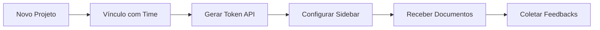

# Conceito de Módulo: Project (Gestão de Contextos)
**Categorias:** Organização, Integração, Operações

---

## 1. Definição e Propósito
O módulo **Project** resolve a necessidade de organizar o conhecimento e as ferramentas em contextos isolados. Seu objetivo é permitir que diferentes times tenham áreas de trabalho distintas, com suas próprias documentações, chaves de integração e métricas de satisfação.

## 2. Fluxo Conceitual (A Experiência do Usuário)
1. **Entrada de Dados:** O usuário (líder de time ou admin) cria um projeto e o associa a um time específico. Define um resumo do propósito do projeto.
2. **Processamento:** O sistema isola este projeto dentro do time selecionado. Ele gera chaves de integração únicas para sistemas externos e permite que o usuário desenhe como as informações serão navegadas através de uma configuração personalizada da barra lateral. O sistema também coleta e processa avaliações (feedbacks) sobre o conteúdo do projeto.
3. **Saída/Resultado:** Um ambiente de trabalho estruturado e monitorado, onde a navegação é intuitiva e o time pode acompanhar o valor entregue através de métricas de engajamento e feedback.

## 3. Funções Principais e Automações
* **Gestão de Contextos:** Criação e manutenção de projetos isolados por time.
* **Configuração de Navegação (Sidebar):** Capacidade de agrupar documentos e links em categorias lógicas para facilitar o acesso.
* **Integração via Tokens:** Geração de chaves seguras para que sistemas externos possam enviar dados ou consultar informações do projeto.
* **Monitoramento de Satisfação:** Sistema de coleta de feedbacks (notas) para medir a qualidade do projeto/documentação.
* **Automação de Rotação de Chaves:** Mecanismo para invalidar e gerar novas chaves de integração sem comprometer o histórico do projeto.

## 4. Regras de Negócio (O "Coração" do Módulo)
* **RN07:** Um projeto deve obrigatoriamente pertencer a um time.
* **RN08:** Chaves de integração (Tokens) nunca são exibidas novamente após a geração inicial ou rotação, forçando práticas de segurança.
* **RN09:** O acesso a um projeto é restrito aos membros do time ao qual o projeto foi vinculado, respeitando o escopo definido no módulo Admin.

## 5. Requisitos do Conceito

### 5.1 Requisitos Funcionais (O que deve existir)
* **RF10:** Capacidade de criar, editar e excluir projetos.
* **RF11:** Possibilidade de gerar e rotacionar tokens de integração seguros.
* **RF12:** Capacidade de configurar a estrutura da barra lateral (grupos e itens) para cada projeto.
* **RF13:** Possibilidade de visualizar um dashboard de feedbacks com média de notas e distribuição.

### 5.2 Requisitos Não Funcionais (Como deve se comportar)
* **RNF05:** Consistência visual: A troca entre projetos deve ser fluida e o estado da barra lateral deve ser preservado.

## 6. Fronteiras e Integrações
* **Comunicação Interna:** Recebe o contexto de time do Módulo **Admin** e fornece os IDs de projeto para o Módulo **Document** vincular os conteúdos.
* **Serviços Externos:** Atua como porta de entrada para integrações via API (webhook/tokens) que desejam consumir ou alimentar o projeto.

---
**Notas de Validação:**
* Confirmar se um projeto pode ser compartilhado entre múltiplos times ou se a exclusividade é mandatória.
* Validar se os feedbacks devem ser anônimos ou vinculados a um usuário de referência.

---
**Fases de Evolução:**
* **Fase 1 (Independente):** CRUD de projetos e descrição simples.
* **Fase 2 (Dependente de Admin):** Scoping por time e controle de acesso granular baseado no cargo do usuário logado.
* **Fase 3 (Dependente de Document):** Customização da sidebar baseada nos documentos criados no módulo Document.
