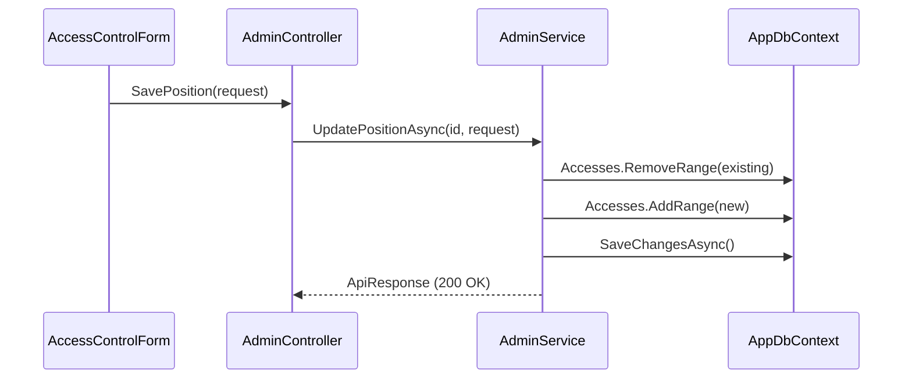

# API Admin — Access Control (Controle de Acesso)

Este documento descreve detalhadamente o sistema de **RBAC (Role-Based Access Control)**, incluindo a gestão de **Departamentos** e **Cargos (Positions)** no DAINAI System.

**Categoria:** Admin, API, RBAC, Security

---

## 1. Requisitos e Regras de Negócio

### Requisitos Funcionais (RF)
- **RF-AC01:** Listar departamentos, cargos, telas e permissões via `GET /api/v1/admin/access-control`. (Alta Prioridade)
- **RF-AC02:** Criar/Editar departamentos via `POST/PUT /api/v1/admin/access-control/departments`. (Alta Prioridade)
- **RF-AC03:** Criar/Editar cargos e definir matriz de permissões via `POST/PUT /api/v1/admin/access-control/positions`. (Alta Prioridade)
- **RF-AC04:** Remover departamentos ou cargos (se não houver vínculos). (Média Prioridade)

### Requisitos Não Funcionais (RNF)
- **RNF-AC01:** Requer permissão `access_control`.
- **RNF-AC02:** As permissões devem ser cacheadas para otimizar a performance da API.

### Regras de Negócio (RN)
- **RN-AC01:** **Bloqueio de Exclusão (Dept):** Um departamento não pode ser removido se possuir cargos vinculados.
- **RN-AC02:** **Bloqueio de Exclusão (Cargo):** Um cargo não pode ser removido se possuir usuários vinculados via `ProfileTeam`.
- **RN-AC03:** **Resolução Automática:** Ao criar um cargo, se for informado um `NewDepartmentName`, o sistema cria o departamento automaticamente ou reutiliza um existente com o mesmo nome (case-insensitive).
- **RN-AC04:** **Escopo de Acesso:** Cada entrada na matriz de permissões possui um escopo (`Global`, `Team`, `User`) que determina a visibilidade dos dados nos módulos operacionais (ex: Wiki, Projetos).

---

## 2. Endpoints

### 2.1 Obter Painel de Controle
- **URL:** `GET /api/v1/admin/access-control`
- **Retorno:** Objeto complexo contendo listagem de cargos, departamentos, telas disponíveis e indicadores.

### 2.2 Salvar Cargo (Position)
- **URL:** `POST/PUT /api/v1/admin/access-control/positions/{id?}`
- **Payload:** `SavePositionRequest` (inclui lista de `Accesses`).

**Lógica de Sincronização:**
Ao atualizar um cargo, o sistema remove todos os acessos anteriores (`Accesses`) e insere a nova matriz enviada pela UI.

---

## 3. Domínio e Persistência

### Entidade: `Position` (Cargo)
**Arquivo:** `Api.Domain/Position.cs`

| Campo | Tipo | Descrição |
|-------|------|-----------|
| `Id` | `int` | PK |
| `Name` | `string` | Nome do cargo |
| `DepartmentId` | `int` | FK → `Departments` |
| `IsActive` | `bool` | Status |
| `Accesses` | `ICollection<Access>` | Matriz de permissões |

### Entidade: `Access` (Permissão Granular)
**Arquivo:** `Api.Domain/Access.cs`

| Campo | Tipo | Descrição |
|-------|------|-----------|
| `PositionId` | `int` | FK → `Positions` |
| `ScreenId` | `int` | FK → `Screens` |
| `PermissionId` | `int` | FK → `Permissions` |
| `Scope` | `string` | `all`, `team` ou `user` |

---

## 4. Arquitetura de Camadas

### Sincronização de Matriz de Permissões

---

## 5. Frontend (Interface do Usuário)

### 5.1 Matriz de Permissões
- **Componente:** `AccessControlForm`
- **Lógica:** Renderiza dinamicamente as telas cadastradas no banco.
- **Validação:** Utiliza `isPermissionSupported` no frontend para desabilitar opções que não fazem sentido lógico para determinada tela.

---

## 6. Referências Cruzadas
- [Admin — Users](./users.md): Atribuição de cargos aos perfis.
- [Auth — Logout & Me](../auth/logout&me.md): Consumo das permissões e escopos para controle de UI e roteamento.
- `Api.Infrastructure/Services/AdminService.cs`: Implementação da lógica de resolução de departamentos.
