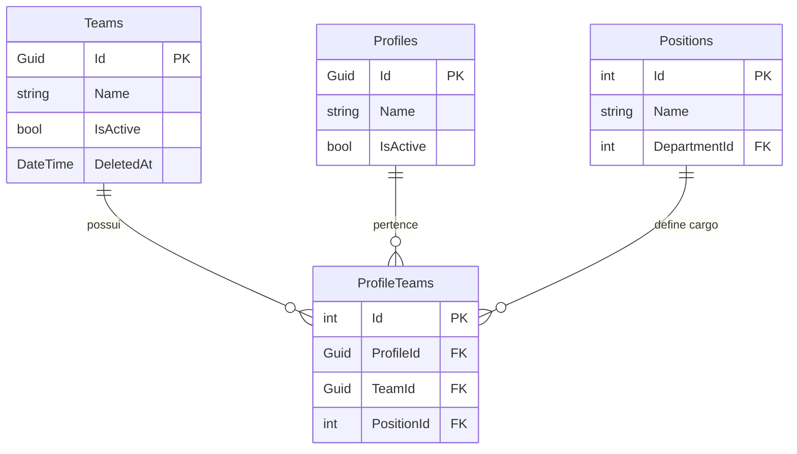
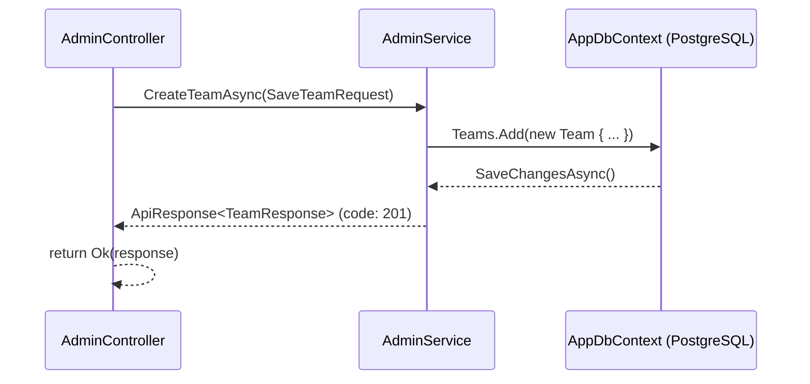

# API Admin — Teams (Equipes)

Este documento descreve detalhadamente os endpoints e a lógica de negócio referentes ao CRUD de **Equipes (Teams)** no módulo administrativo do DAINAI System.

**Categoria:** Admin, API, RBAC

---

## 1. Requisitos e Regras de Negócio

Para garantir a rastreabilidade e priorização, cada item possui um identificador único.

### Requisitos Funcionais (RF)
- **RF-TM01:** Listar todas as equipes ativas (não excluídas) via `GET /api/v1/admin/teams`. (Alta Prioridade)
- **RF-TM02:** Obter os dados de uma equipe específica via `GET /api/v1/admin/teams/{id}`. (Alta Prioridade)
- **RF-TM03:** Criar uma nova equipe com nome e status via `POST /api/v1/admin/teams`. (Alta Prioridade)
- **RF-TM04:** Atualizar dados de uma equipe existente via `PUT /api/v1/admin/teams/{id}`. (Alta Prioridade)
- **RF-TM05:** Remover (soft delete) uma equipe via `DELETE /api/v1/admin/teams/{id}`. (Alta Prioridade)

### Requisitos Não Funcionais (RNF)
- **RNF-TM01:** Todos os endpoints requerem autenticação via cookie de sessão (`[Authorize]`).
- **RNF-TM02:** O acesso é controlado por permissões RBAC sob a chave `teams_management`.
- **RNF-TM03:** A exclusão é do tipo **soft delete** — o registro é preservado no banco com o campo `DeletedAt` preenchido, nunca removido fisicamente.

### Regras de Negócio (RN)
- **RN-TM01:** O campo `Name` é obrigatório na criação e atualização.
- **RN-TM02:** Uma equipe **não pode ser excluída** se houver usuários (`ProfileTeam`) vinculados a ela.
- **RN-TM03:** Equipes com `IsActive = false` ainda aparecem na listagem administrativa (visibilidade total), mas **bloqueiam o login** dos usuários exclusivamente vinculados a elas. Veja cross-reference em [Login – RN02](../auth/login.md#1-requisitos-e-regras-de-negócio).
- **RN-TM04:** A listagem exclui automaticamente equipes com `DeletedAt != null`.
- **RN-TM05:** Um usuário pode pertencer a mais de uma equipe. O bloqueio de login por equipe inativa (**RN-TM03**) só é aplicado quando **todas** as equipes do usuário estão inativas.

---

## 2. Endpoints

### 2.1 Listar Equipes

- **URL:** `GET /api/v1/admin/teams`
- **Permissão:** `teams_management` → `view`
- **Autenticação:** Cookie de sessão obrigatório

**Resposta de Sucesso — `200 OK`**
```json
{
  "code": "200",
  "message": "",
  "data": [
    {
      "id": "d1000000-0000-0000-0000-000000000001",
      "name": "Equipe Alpha",
      "isActive": true
    }
  ]
}
```

**Respostas de Erro**

| Status | Cenário |
|--------|---------|
| `401 Unauthorized` | Usuário não autenticado (**RNF-TM01**) |
| `403 Forbidden` | Usuário autenticado, mas sem permissão `view` em `teams_management` (**RNF-TM02**) |

---

### 2.2 Obter Equipe por ID

- **URL:** `GET /api/v1/admin/teams/{id}`
- **Permissão:** `teams_management` → `view`

**Resposta de Sucesso — `200 OK`**
```json
{
  "code": "200",
  "message": "",
  "data": {
    "id": "d1000000-0000-0000-0000-000000000001",
    "name": "Equipe Alpha",
    "isActive": true
  }
}
```

**Respostas de Erro**

| Status | Cenário |
|--------|---------|
| `401 Unauthorized` | Usuário não autenticado |
| `404 Not Found` | ID inexistente ou equipe com `DeletedAt != null` (**RN-TM04**) |

---

### 2.3 Criar Equipe

- **URL:** `POST /api/v1/admin/teams`
- **Permissão:** `teams_management` → `create`
- **Content-Type:** `application/json`

**Requisição**
```json
{
  "name": "Equipe Beta",
  "isActive": true
}
```

| Campo | Tipo | Obrigatório | Validação |
|-------|------|-------------|-----------|
| `name` | `string` | ✅ | Não pode ser vazio (**RN-TM01**) |
| `isActive` | `bool` | ✅ | `true` ou `false` |

**Resposta de Sucesso — `200 OK`**
```json
{
  "code": "201",
  "message": "Equipe criada com sucesso",
  "data": {
    "id": "f3000000-0000-0000-0000-000000000099",
    "name": "Equipe Beta",
    "isActive": true
  }
}
```

> [!NOTE]
> O serviço retorna internamente o código `"201"`, mas o controller HTTP responde com `200 OK`. Este é um detalhe de implementação vigente.

---

### 2.4 Atualizar Equipe

- **URL:** `PUT /api/v1/admin/teams/{id}`
- **Permissão:** `teams_management` → `update`

**Requisição** — mesmo schema de `SaveTeamRequest` (veja 2.3).

**Resposta de Sucesso — `200 OK`**
```json
{
  "code": "200",
  "message": "Equipe atualizada com sucesso",
  "data": { ... }
}
```

**Respostas de Erro**

| Status | Cenário |
|--------|---------|
| `404 Not Found` | Equipe não encontrada pelo ID informado |

---

### 2.5 Excluir Equipe (Soft Delete)

- **URL:** `DELETE /api/v1/admin/teams/{id}`
- **Permissão:** `teams_management` → `delete`

**Comportamento (RNF-TM03 + RN-TM02):**
A exclusão define `DeletedAt = DateTime.UtcNow` no registro. Antes disso, verifica se há entradas em `ProfileTeams` com o `TeamId` informado. Em caso positivo, rejeita a operação com `400`.

**Resposta de Sucesso — `200 OK`**
```json
{
  "code": "200",
  "message": "Equipe removida com sucesso",
  "data": null
}
```

**Respostas de Erro**

| Status | Cenário |
|--------|---------|
| `400 Bad Request` | Equipe possui usuários vinculados (**RN-TM02**) |
| `404 Not Found` | Equipe não encontrada |

---

## 3. Domínio e Persistência

### Entidade: `Team`

**Arquivo:** `Api.Domain/Team.cs`

| Campo | Tipo | Descrição |
|-------|------|-----------|
| `Id` | `Guid` | Chave primária gerada automaticamente |
| `Name` | `string` | Nome da equipe (obrigatório) |
| `IsActive` | `bool` | Indica se a equipe está ativa (padrão: `true`) |
| `DeletedAt` | `DateTime?` | Soft delete — herdado de `BaseEntity<Guid>` |
| `ProfileTeams` | `ICollection<ProfileTeam>` | Navegação para os vínculos de usuários |

### Entidade de Junção: `ProfileTeam`

**Arquivo:** `Api.Domain/ProfileTeam.cs`

A tabela `ProfileTeams` é o ponto central de associação entre **usuários**, **equipes** e **cargos (Positions)**. Um `Profile` pode ter múltiplos registros de `ProfileTeam`, um para cada combinação de equipe + cargo.

| Campo | Tipo | Descrição |
|-------|------|-----------|
| `Id` | `int` | PK |
| `ProfileId` | `Guid` | FK → `Profiles` |
| `TeamId` | `Guid` | FK → `Teams` |
| `PositionId` | `int` | FK → `Positions` |

### Tabelas Envolvidas



---

## 4. Arquitetura de Camadas

### Fluxo de Execução (Criar Equipe como exemplo)



---

## 5. Impacto no Sistema

### 5.1 Impacto no Módulo Auth

> [!IMPORTANT]
> O estado `IsActive` de uma equipe afeta diretamente o processo de autenticação. Consulte [Login – RN02](../auth/login.md#1-requisitos-e-regras-de-negócio).

- Quando um usuário tenta fazer login, o `AuthService` verifica se **todas** as equipes do usuário estão inativas.
- Se o usuário pertencer a **somente uma equipe** e ela estiver com `IsActive = false`, o login é **bloqueado** com `403 Forbidden`.
- Se o usuário pertencer a **múltiplas equipes**, o login é permitido desde que **ao menos uma equipe esteja ativa**.

### 5.2 Impacto no Módulo de Usuários (User Management)

- A listagem `GET /api/v1/admin/users` e `GET /api/v1/admin/users/options` **incluem todas as equipes não excluídas** como opções de vínculo.
- Ao criar ou editar um usuário (`SaveUserRequest`), é obrigatório informar ao menos uma `ProfileTeamAssignment` (equipe + cargo).
- A response de usuário (`UserManagementUserResponse`) retorna todos os `ProfileTeams` expandidos com nome da equipe, cargo e departamento.

### 5.3 Impacto no Módulo de Controle de Acesso (RBAC)

- `ProfileTeam` é o elo entre usuário e cargo (`Position`). O cargo define quais telas (`Screens`) e permissões (`Permissions`) o usuário possui.
- Excluir uma equipe com usuários vinculados é **bloqueado** (**RN-TM02**) exatamente para preservar esta cadeia de acesso.

---

## 6. Testes E2E

**Arquivo:** `Api.Tests/E2E/TeamsE2ETests.cs`

| Teste | Cenário | Resultado Esperado |
|-------|---------|-------------------|
| `GetTeams_WhenAuthenticated_Returns200WithList` | Admin autenticado busca lista | `200 OK` com campo `data` |
| `CreateTeam_WithValidData_Returns200AndPersists` | Criação com nome único | `200 OK` + equipe aparece na listagem |
| `UpdateTeam_WithValidId_Returns200` | Atualização de equipe existente | `200 OK` + nome atualizado na listagem |
| `DeleteTeam_WithValidId_Returns200` | Exclusão de equipe sem usuários | `200 OK` |
| `GetTeams_WhenNotAuthenticated_Returns401` | Acesso sem sessão | `401 Unauthorized` |
| `UpdateTeam_WithNonExistentId_Returns404` | Update com ID inexistente | `404 Not Found` |
| `DeleteTeam_WithNonExistentId_Returns404` | Delete com ID inexistente | `404 Not Found` |
| `DeleteTeam_WithLinkedUsers_ReturnsBadRequest` | Delete de equipe seed com usuários | `400 Bad Request` |

---

## 8. Frontend (Interface do Usuário)

A interface de gerenciamento de equipes segue o padrão de **Alta Densidade** e **Responsividade Mobile-First** do sistema.

### 8.1 Componentes Utilizados
- **Página:** `app/(private)/admin/teams/page.tsx`
- **Tabela:** `DataTable` (Componente Genérico)
- **Formulário:** `TeamForm` (Modal ou Página)

### 8.2 Comportamento da Listagem (DataTable)
- **Desktop:** Exibição em grade tabular com colunas: Nome, Status (Badge), Ações (Botões de ícone com Tooltip).
- **Mobile (Card View):** A tabela é convertida automaticamente em **Cards** individuais para melhor usabilidade em telas pequenas.
  - **Menu de Ações:** No mobile, os botões de ícone são substituídos por um menu dropdown (`DropdownMenu`) com labels descritivas.
  - **Resumo de Dados:** Exibe os 3 primeiros campos principais, com opção de expandir para ver detalhes adicionais.

### 8.3 Permissões e UI
- **Criação:** O botão "Novo Registro" só é renderizado se o usuário possuir a permissão `create`.
- **Ações de Linha:** Os botões de Editar e Excluir são filtrados em tempo de execução com base nas flags `canUpdate` e `canDelete` retornadas pelo hook `useAdminModule`.
- **Estado de Carregamento:** Utiliza esqueletos de carregamento (`Skeleton`) e spinners integrados ao `FormLayout` para garantir feedback visual durante operações assíncronas.

---

## 9. Referências Cruzadas

- [Auth — Login](../auth/login.md): Regra de bloqueio por equipe inativa (RN02).
- [Auth — Logout & Me](../auth/logout&me.md): Gestão de sessão e cache de permissões (RBAC).
- `Api.Domain/ProfileTeam.cs`: Entidade de vínculo entre Profile, Team e Position.
- `Api.Domain/Team.cs`: Entidade de domínio central deste módulo.
](../auth/logout&me.md): Gestão de sessão e cache de permissões (RBAC).
- `Api.Domain/ProfileTeam.cs`: Entidade de vínculo entre Profile, Team e Position.
- `Api.Domain/Team.cs`: Entidade de domínio central deste módulo.
