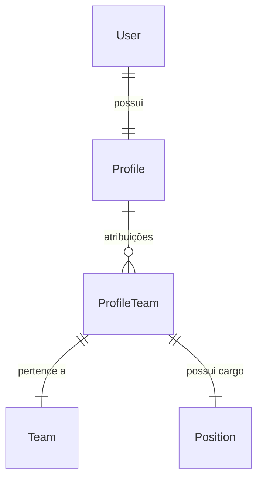
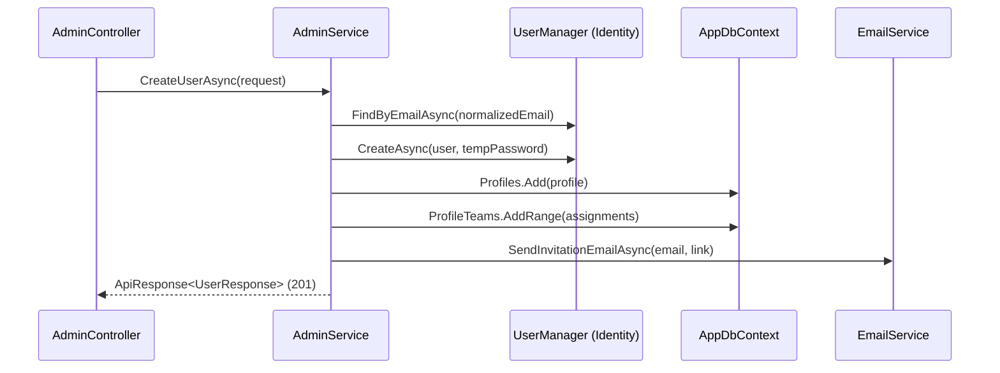

# API Admin — Users (Gerenciamento de Usuários)

Este documento descreve detalhadamente os endpoints e a lógica de negócio referentes ao gerenciamento de **Usuários (Users)** no módulo administrativo do DAINAI System.

**Categoria:** Admin, API, User Management, RBAC

---

## 1. Requisitos e Regras de Negócio

### Requisitos Funcionais (RF)
- **RF-US01:** Listar todos os usuários via `GET /api/v1/admin/users`. (Alta Prioridade)
- **RF-US02:** Obter os dados de um usuário específico via `GET /api/v1/admin/users/{id}`. (Alta Prioridade)
- **RF-US03:** Criar um novo usuário e enviar convite por e-mail via `POST /api/v1/admin/users`. (Alta Prioridade)
- **RF-US04:** Atualizar dados do perfil, avatar e vínculos de um usuário via `PUT /api/v1/admin/users/{id}`. (Alta Prioridade)
- **RF-US05:** Remover (soft delete) um usuário via `DELETE /api/v1/admin/users/{id}`. (Alta Prioridade)
- **RF-US06:** Reenviar o link de convite para um usuário via `POST /api/v1/admin/users/{id}/resend-invitation`. (Média Prioridade)

### Requisitos Não Funcionais (RNF)
- **RNF-US01:** Requer autenticação via cookie e permissão `users_management`.
- **RNF-US02:** Senhas são geradas temporariamente e nunca expostas; o acesso é via link de convite.
- **RNF-US03:** O sistema utiliza `UserManager` do Identity para credenciais e `AppDbContext` para perfis.

### Regras de Negócio (RN)
- **RN-US01:** O e-mail deve ser único (comparação case-insensitive e trim).
- **RN-US02:** Todo usuário deve possuir ao menos uma atribuição válida de Equipe e Cargo (`ProfileTeam`).
- **RN-US03:** Ao remover um usuário (`soft delete`), o registro é mantido com `DeletedAt`, e o login é bloqueado no Identity (`LockoutEnabled = true`).
- **RN-US04:** Ao alterar o status para `IsActive = false`, o usuário perde o acesso imediatamente e seu cache de RBAC é invalidado.
- **RN-US05:** O link de convite expira em 168 horas (7 dias) e utiliza o prefixo `reset_` no cache (Redis/Memory).

---

## 2. Endpoints

### 2.1 Listar Usuários
- **URL:** `GET /api/v1/admin/users`
- **Permissão:** `users_management` → `view`

**Resposta de Sucesso — `200 OK`**
Retorna a lista de usuários, indicadores de status (Total, Ativos, Inativos) e as opções (Equipes/Cargos) para facilitar o carregamento da UI.

---

### 2.2 Criar Usuário
- **URL:** `POST /api/v1/admin/users`
- **Permissão:** `users_management` → `create`

**Fluxo Interno:**
1. Valida se o e-mail já existe.
2. Valida se todas as Equipes e Cargos enviados existem e não estão excluídos.
3. Cria o `User` no Identity com senha aleatória.
4. Cria o `Profile` vinculado ao `User.Id`.
5. Cria as entradas em `ProfileTeams`.
6. Gera token de convite e envia e-mail.

---

### 2.3 Excluir Usuário (Soft Delete)
- **URL:** `DELETE /api/v1/admin/users/{id}`
- **Permissão:** `users_management` → `delete`

**Comportamento:**
- Define `DeletedAt` no `Profile`.
- Define `LockoutEnd = DateTimeOffset.MaxValue` no `User` do Identity.
- Remove arquivos físicos de avatar associados.
- Invalida todos os caches de permissão (`rbac_*`).

---

## 3. Domínio e Persistência

### Entidade: `Profile`
**Arquivo:** `Api.Domain/Profile.cs`

| Campo | Tipo | Descrição |
|-------|------|-----------|
| `Id` | `Guid` | PK (mesmo ID do User) |
| `UserId` | `Guid` | FK → `AspNetUsers` |
| `Name` | `string` | Nome completo |
| `AvatarUrl` | `string` | URL do avatar no storage |
| `IsActive` | `bool` | Status de acesso |
| `DeletedAt` | `DateTime?` | Soft delete |

### Relacionamentos

---

## 4. Arquitetura de Camadas

### Sequência: Criação de Usuário

---

## 5. Frontend (Interface do Usuário)

### 5.1 Componentes Utilizados
- **Página:** `app/(private)/admin/users/page.tsx`
- **Formulário:** `UserForm` (em `components/form/user-form.tsx`)

### 5.2 Funcionalidades Críticas
- **Multi-Assignment:** Permite adicionar e remover linhas de atribuição (Equipe + Departamento + Cargo).
- **Avatar Upload:** Integração com `StorageController` para upload imediato com preview.
- **Resumo Mobile:** Cards responsivos com status e ações rápidas (Reenviar convite, Editar, Excluir).

---

## 6. Referências Cruzadas
- [Admin — Teams](./teams.md): Regras de exclusão e vínculos.
- [Admin — Access Control](./access-control.md): Definição de cargos e departamentos.
- [Auth — Login](../auth/login.md): Bloqueio por status de perfil ou usuário.
