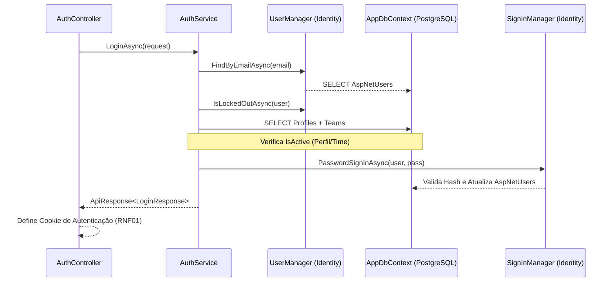

# API de Autenticação - Login

Este documento descreve detalhadamente o endpoint e a lógica de API referente ao processo de autenticação (Login) do sistema DAINAI.

**Categoria:** Core, API, Segurança

---

## 1. Requisitos e Regras de Negócio

Para garantir a rastreabilidade e priorização, cada item possui um identificador único.

### Requisitos Funcionais (RF)
- **RF01:** Realizar autenticação do usuário utilizando e-mail e senha através do endpoint `POST /api/v1/auth/login`. (Alta Prioridade)
- **RF02:** Validar obrigatoriedade e formato dos campos de entrada antes de processar a autenticação. (Média Prioridade)

### Requisitos Não Funcionais (RNF)
- **RNF01:** Utilizar cookies seguros para manutenção da sessão (`HttpOnly`, `Secure`, `SameSite=Strict`).
- **RNF02:** Retornar mensagens de erro genéricas em falhas de autenticação para evitar vazamento de informações sobre a existência de contas.

### Regras de Negócio (RN)
- **RN01:** Bloquear o login caso o perfil do usuário (`Profile.IsActive`) esteja desativado.
- **RN02:** Bloquear o login caso a única equipe vinculada ao usuário esteja inativa.
- **RN03:** Implementar bloqueio temporário (Lockout) de 15 minutos após 5 tentativas falhas consecutivas.
- **RN04:** Limpar obrigatoriamente o cache de permissões do usuário (`rbac_v4_{userId}`) a cada login bem-sucedido. Para detalhes da estratégia de cache, veja [RN05 e RN07 em Logout & Me](logout&me.md).

---

## 2. Endpoint: Realizar Login

- **URL:** `POST /api/v1/auth/login`
- **Autenticação:** Nenhuma (AllowAnonymous)
- **Content-Type:** `application/json`

### Requisição
```json
{
  "email": "admin@empresa.com",
  "password": "Admin123!"
}
```

### Respostas de Sucesso
**Status Code:** `200 OK`
```json
{
  "code": "200",
  "message": "Login realizado com sucesso",
  "data": {
    "userId": "a571f576-c2f7-48a4-b7a4-250658b28ecf",
    "email": "admin@empresa.com",
    "name": "Administrador Root"
  }
}
```
*Nota: A API também retorna um cookie de autenticação `AuthToken` ou `.AspNetCore.Identity.Application` conforme definido em **RNF01**.*

---

### Respostas de Erro e Cenários

#### A. Credenciais Inválidas ou Perfil Inativo (**RN01** / **RNF02**)
**Status Code:** `401 Unauthorized`
```json
{
  "code": "401",
  "message": "E-mail ou senha inválidos.",
  "data": null
}
```

#### B. Conta Bloqueada (**RN03**)
**Status Code:** `401 Unauthorized`
```json
{
  "code": "401",
  "message": "Muitas tentativas falhas. Conta bloqueada temporariamente.",
  "data": null
}
```

#### C. Erro de Validação (**RF02**)
**Status Code:** `400 Bad Request`
```json
{
  "code": "400",
  "message": "O e-mail é obrigatório",
  "data": null
}
```

#### D. Equipe Inativa (**RN02**)
**Status Code:** `403 Forbidden`
```json
{
  "code": "403",
  "message": "Sua equipe está inativa. Entre em contato com o administrador.",
  "data": null
}
```

---

## 3. Arquitetura e Persistência

### Tabelas Envolvidas
- **`AspNetUsers`**: Credenciais e metadados de segurança (**RN03**).
- **`Profiles`**: Estado de ativação (**RN01**).
- **`Teams`**: Estado da equipe (**RN02**).

### Fluxo de Execução



---

## 4. Implementação Web (Next.js)

### Estrutura e Lógica
1. **Server Action:** O login é processado em `apps/web/lib/action/auth-actions.ts`, que espelha o cookie do backend para o frontend (**RNF01**).
2. **UX:** Utiliza `useActionState` para feedback de carregamento e `notify` (Sonner) para Toasts.
3. **Componentes:** O formulário principal é renderizado em `login-form.tsx` e faz uso intenso de UI Components modernos.

### Padronização de Layout (CompactFormLayout)
Todo o módulo de autenticação (e formulários standalone similares) adota um padrão arquitetural unificado:
- **`AuthLayout` (`apps/web/app/auth/layout.tsx`)**: Provê o esqueleto externo responsivo, grid dinâmico e o painel institucional decorativo à direita (em telas grandes).
- **`CompactFormLayout` (`apps/web/components/layouts/compact-form-layout.tsx`)**: Wrapper central responsável por encapsular as animações padronizadas, estado de loading (`isPending`), spinner, botão de submissão unificado e a consistência tipográfica (Title, Description, Footer links) dos formulários. Esse componente reduz drasticamente as classes Tailwind repetitivas nos arquivos de formulário individuais.

---

## 5. Referências Cruzadas
- [Logout & Me](logout&me.md): Gestão de sessão e cache após o login.
- [Recuperação de Senha](password.md): Fluxo para usuários que esqueceram a senha.

