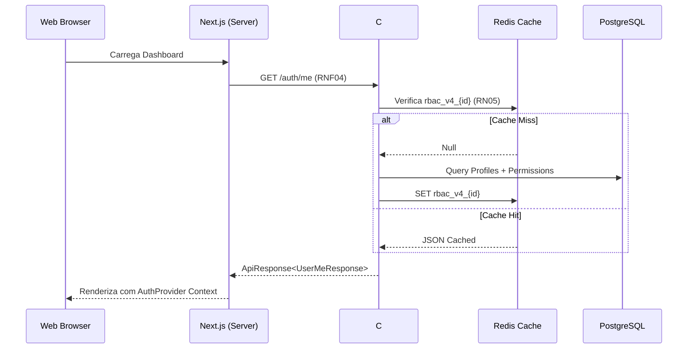

# API de Autenticação - Perfil e Sessão (Logout & Me)

Este documento descreve detalhadamente os processos de recuperação de perfil (RBAC) e encerramento de sessão, garantindo a integridade dos dados e a segurança do usuário.

**Categoria:** Core, API, Sessão, RBAC

---

## 1. Requisitos e Regras de Negócio

### Requisitos Funcionais (RF)
- **RF03:** Recuperar os dados do usuário autenticado, incluindo suas equipes e o mapa detalhado de acessos (RBAC), através do endpoint `GET /api/v1/auth/me`. (Alta Prioridade)
- **RF04:** Encerrar a sessão do usuário, invalidando o token no servidor e limpando rastros no cliente, através do endpoint `POST /api/v1/auth/logout`. (Alta Prioridade)

### Requisitos Não Funcionais (RNF)
- **RNF03:** Implementar proteção de rotas no Edge (Proxy/Middleware) para bloquear acessos não autorizados antes do carregamento do frontend.
- **RNF04:** Injetar automaticamente o header `X-Active-Team-Id` em todas as requisições para contextualizar as permissões no backend.

### Regras de Negócio (RN)
- **RN05:** Utilizar cache Redis para armazenar o mapa de permissões (`rbac_v4_{userId}`) com TTL de 1 hora.
- **RN06:** Manter compatibilidade com prefixos de cache anteriores (`rbac_`, `rbac_v2_`, `rbac_v3_`) durante transições de deploy.
- **RN07:** Invalidar o cache de permissões proativamente em: Logout, alteração de cargos/permissões ou redefinição de senha (veja [RN14 em Password](password.md)).
- **RN08:** Disparar logout automático e redirecionamento para login ao detectar erro `401 Unauthorized`.
- **RN09:** Preservar preferências de tema (claro/escuro) do usuário mesmo após o logout.

---

## 2. Endpoint: Obter Perfil e Permissões (Me)

- **URL:** `GET /api/v1/auth/me`
- **Autenticação:** Obrigatória (Cookie-based)
- **Cache:** Redis (**RN05**)

### Resposta de Sucesso
**Status Code:** `200 OK`
```json
{
  "code": "200",
  "message": "Perfil recuperado com sucesso",
  "data": {
    "profile": { "id": "uuid", "email": "admin@empresa.com", "name": "Admin" },
    "teams": [{ "id": "team-001", "name": "Operações TI", "isActive": true }],
    "teamAccesses": [
      {
        "teamId": "team-001",
        "position": "Gestor",
        "accesses": [{ "nameKey": "system_logs", "permissions": ["view", "update"] }]
      }
    ]
  }
}
```

---

## 3. Endpoint: Encerrar Sessão (Logout)

- **URL:** `POST /api/v1/auth/logout`
- **Autenticação:** Obrigatória

### Fluxo de Execução
1. **Servidor:** Invalida o cookie de sessão e remove a chave de cache (**RN07**).
2. **Cliente:** Remove cookies locais e dados de equipe, mas mantém o tema (**RN09**).

---

## 4. Arquitetura e Implementação

### Gestão de Cache (Redis)
Este documento é a autoridade central para a arquitetura de cache do sistema. O DAINAI utiliza uma estratégia agressiva para o endpoint `/me` devido à complexidade da árvore de permissões (**RN05**, **RN06**).

### Fluxo de Dados (Sequência)



---

## 5. Implementação Web (Next.js)

1. **AuthProvider:** Centraliza o estado `User | null` e monitora erros `401` para logout automático (**RN08**).
2. **API Client (`apiFetch`):** Wrapper que injeta o header de equipe (**RNF04**) e trata erros de autenticação.
3. **Proxy Guard:** O arquivo `apps/web/proxy.ts` atua como o **Edge Guard** (**RNF03**), protegendo rotas privadas.

---

## 6. Referências Cruzadas
- [Login](login.md): Origem da sessão e primeira limpeza de cache (**RN04**).
- [Recuperação de Senha](password.md): Gatilho de invalidação de cache por segurança (**RN14**).
nte `/_next`, `/api`, `/auth` e `/favicon.ico` para evitar loops de redirecionamento.
