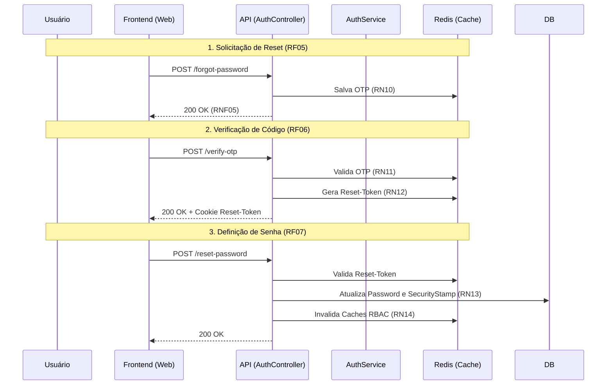

# API de Autenticação - Recuperação de Senha

Este documento descreve detalhadamente os endpoints e a lógica de API referente ao processo de recuperação de senha (Forgot Password, Verify OTP e Reset Password) do sistema DAINAI.

**Categoria:** Core, API, Segurança

---

## 1. Requisitos e Regras de Negócio

### Requisitos Funcionais (RF)
- **RF05:** Solicitar código de recuperação (OTP) via e-mail através do endpoint `POST /api/v1/auth/forgot-password`. (Média Prioridade)
- **RF06:** Verificar validade do código OTP e emitir token de reset através do endpoint `POST /api/v1/auth/verify-otp`. (Média Prioridade)
- **RF07:** Redefinir a senha do usuário utilizando o token de reset através do endpoint `POST /api/v1/auth/reset-password`. (Alta Prioridade)

### Requisitos Não Funcionais (RNF)
- **RNF05:** Implementar proteção anti-enumeração de contas, retornando `200 OK` mesmo que o e-mail não exista no sistema.

### Regras de Negócio (RN)
- **RN10:** O código OTP deve expirar em 10 minutos após a geração.
- **RN11:** Limitar a 5 tentativas falhas de verificação de OTP antes de bloquear o processo para o e-mail.
- **RN12:** O `Reset-Token` gerado após a verificação de OTP deve expirar em 10 minutos.
- **RN13:** Atualizar o `SecurityStamp` do usuário ao trocar a senha, invalidando todas as sessões ativas (Cookies).
- **RN14:** Invalidar todas as versões de cache de permissões do Redis após a troca bem-sucedida de senha. Veja detalhes em [RN07 em Logout & Me](logout&me.md).

---

## 2. Fluxo de Recuperação

O processo é dividido em três etapas sequenciais:

---

## 3. Detalhes dos Endpoints

### 3.1 Solicitar Código (**RF05**)
- **URL:** `POST /api/v1/auth/forgot-password`
- **Segurança:** Retorna sempre `200 OK` (**RNF05**).

### 3.2 Verificar Código (**RF06**)
- **URL:** `POST /api/v1/auth/verify-otp`
- **Payload:** `{ "email": "string", "code": "string" }`
- **Regras:** Valida expiração (**RN10**) e limite de tentativas (**RN11**).

### 3.3 Redefinir Senha (**RF07**)
- **URL:** `POST /api/v1/auth/reset-password`
- **Headers:** Requer o Cookie `Reset-Token` (**RN12**).
- **Ações:** Atualiza banco (**RN13**) e limpa cache (**RN14**).

---

## 4. Implementação Web (Next.js)

1. **Componentes:** O fluxo interage com `ForgotPasswordForm`, `VerifyOtpForm` (utilizando `InputOTP`) e `ResetPasswordForm`.
2. **Padronização de Layout:** Todos os formulários acima utilizam o `CompactFormLayout` (`apps/web/components/layouts/compact-form-layout.tsx`) para manter total consistência visual com o restante do módulo de autenticação. Ele gerencia as animações de entrada, estados de carregamento e tipografia, permitindo que os formulários foquem apenas na lógica.
3. **Integração:** Utiliza a biblioteca `notify` para feedback visual e gerencia o roteamento sequencial via estados de sucesso.
4. **Segurança:** O `Reset-Token` é gerenciado inteiramente pelo navegador via Cookie seguro enviado pela API, não sendo armazenado no estado do frontend.

---

## 5. Referências Cruzadas
- [Login](login.md): Destino final após a troca de senha bem-sucedida.
- [Logout & Me](logout&me.md): Autoridade sobre a estratégia de invalidação de cache (**RN07**).
