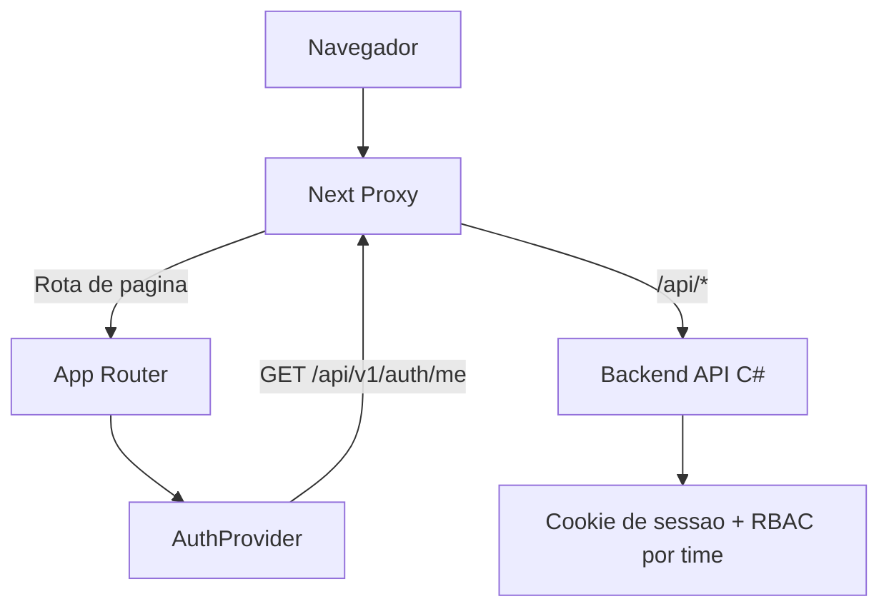

# 🧱 Arquitetura Web

## Visao Geral

A aplicacao usa Next.js App Router com separacao clara entre:

- rotas publicas (`/auth/*`)
- rotas privadas (`/dashboard`)
- proxy de API (`/api/*` -> backend C#)

## Camadas

1. Roteamento e layouts

- `app/layout.tsx`: shell global
- `app/auth/layout.tsx`: layout de autenticacao
- `app/(private)/layout.tsx`: layout autenticado com sidebar

2. Sessao e identidade

- `components/providers/auth-provider.tsx`
- carrega `/api/v1/auth/me`
- seleciona e persiste `active_team_id`

3. Seguranca de borda

- `proxy.ts`
- bloqueia rotas privadas sem cookie (`AuthToken` ou `.AspNetCore.Identity.Application`)
- redireciona usuario autenticado fora do login
- injeta `X-Active-Team-Id` em chamadas `/api/*`

4. UI e navegacao

- `components/sidebar/*`
- itens de menu filtrados por permissao

## Fluxo de Requisicao

## Decisoes Importantes

- Sessao em cookie HTTP-only para reduzir exposicao de token no cliente.
- Selecao de time ativa no frontend e enviada por header para API.
- Filtro de menu realizado no cliente com base em `teamAccesses`.
