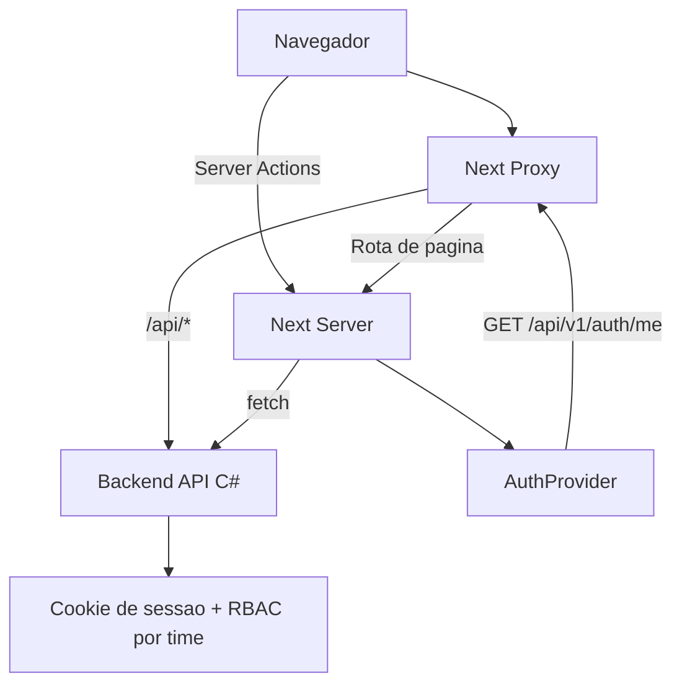

# 🧱 Arquitetura Web

## Visao Geral

A aplicacao usa Next.js App Router com separacao clara entre:

- rotas publicas (`/auth/*`)
- rotas privadas (`/dashboard`)
- proxy de API (`/api/*` -> backend C#)

## Camadas

1. Roteamento e layouts

- `app/layout.tsx`: shell global
- `app/auth/layout.tsx`: layout de autenticacao
- `app/(private)/layout.tsx`: layout autenticado com sidebar

2. Sessao e identidade

- `components/providers/auth-provider.tsx`
- carrega `/api/v1/auth/me`
- seleciona e persiste `active_team_id`

3. Seguranca de borda

- `proxy.ts`
- bloqueia rotas privadas sem cookie (`AuthToken` ou `.AspNetCore.Identity.Application`)
- redireciona usuario autenticado fora do login
- injeta `X-Active-Team-Id` em chamadas `/api/*`

4. UI e navegacao

- `components/sidebar/*`
- itens de menu filtrados por permissao



## Padrao de Comunicacao (Server Actions)

A partir da versao atual, o sistema padroniza o uso de **Server Actions** para todas as operacoes que alteram estado (POST, PUT, DELETE) e, preferencialmente, para buscas de dados em paginas administrativas.

### Vantagens:
- **Seguranca**: Credenciais (cookies/tokens) sao manipulados apenas no servidor.
- **Tipagem**: Contratos estritos entre as Actions e os Formulares.
- **Performance**: Reducao de round-trips complexos no cliente.

### Localizacao:
As actions sao organizadas por modulo em `apps/web/lib/[module]-actions.ts`.

## Módulos Administrativos Padronizados

Para garantir consistência e facilitar a replicação de telas de CRUD (como Usuários, Times, etc.), a aplicação utiliza um padrão arquitetural baseado em:

### 1. Hook `useAdminPage`

Centraliza a lógica de:

- Busca de dados vinculada ao `activeTeamId`.
- Gerenciamento de estados de carregamento e erro.
- Cálculo de permissões granulares (`view`, `create`, `update`, `delete`) baseado no `screenKey`.

### 2. Layouts Padronizados (`AdminPageLayout`)

Conjunto de componentes estruturais:

- `AdminPage`: Container principal com espaçamento padrão.
- `AdminPageHeader`: Integração com `PageHeader` e Breadcrumbs.
- `AdminPageIndicators`: Grid para `StatCard` com métricas.
- `AdminPageTableContainer`: Container flexível para `DataTable`.

## Decisões Importantes

- Sessão em cookie HTTP-only para reduzir exposição de token no cliente.
- Seleção de time ativa no frontend e enviada por header para API.
- Filtro de menu realizado no cliente com base em `teamAccesses`.
- **Soft Delete**: Entidades administrativas são marcadas como removidas no banco sem exclusão física.
- **Visualização de Status**: Times inativos são marcados visualmente no switcher e bloqueados para seleção.

## 🏗️ Padrões de Renderização e Build

### CSR Bailout & Suspense

Devido às otimizações de build do Next.js 15+ (Turbopack), qualquer componente que utilize o hook `useSearchParams()` deve obrigatoriamente estar envolvido em um limite de `<Suspense>`.

**Por que?**
O uso de `useSearchParams()` em uma página que não é estática (ou durante a pré-renderização estática) causa o "bailout" da renderização no lado do servidor. Sem o `<Suspense>`, o build falhará com o erro `missing-suspense-with-csr-bailout`.

**Como Implementar**:
Sempre envolva o conteúdo da página que consome parâmetros de busca em um componente separado e exporte a página com o wrapper:

```tsx
function PageContent() {
  const searchParams = useSearchParams()
  // ... lógica
}

export default function Page() {
  return (
    <Suspense fallback={<Spinner />}>
      <PageContent />
    </Suspense>
  )
}
```
